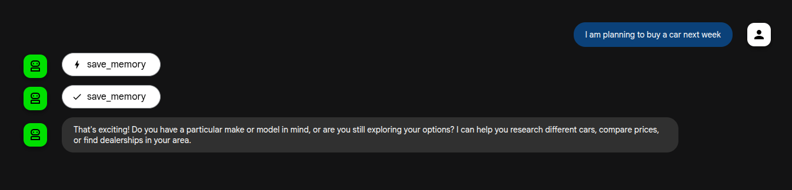
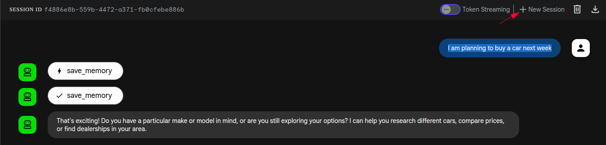
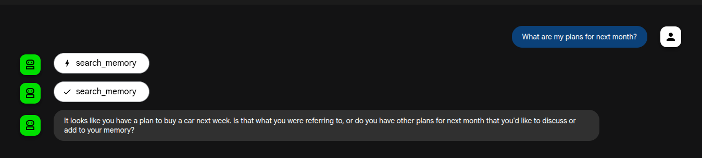

## Overview

This tutorial details the process of building and deploying a [Google Agent Development Kit (ADK)](https://google.github.io/adk-docs/) application that utilizes [mem0](https://docs.mem0.ai/introduction) to retain information across different sessions. It is based on [mem0 Google Agent Development Kit example
](https://docs.mem0.ai/integrations/google-ai-adk).

It uses [ADK agent tools](https://google.github.io/adk-docs/tools/) to invoke mem0 client that has to save or search information from the vector database that is hosted on [CloudSQL](https://cloud.google.com/sql/docs/introduction).
More information on the used agent can be found in the [source code](https://github.com/ai-on-gke/tutorials-and-examples/tree/main/adk/memory/adk-app/agent_with_memory/agent.py).

The tutorial will cover:

* Setting up your Google Cloud environment.  
* Building a container image for your agent.  
* Deploying the agent to a GKE cluster.  
* Testing your deployed agent.

## Before you begin

Ensure you have the following tools installed on your workstation  
   * [gcloud CLI](https://cloud.google.com/sdk/docs/install)  
   * [kubectl](https://kubernetes.io/docs/tasks/tools/#kubectl)  
   * [terraform](https://developer.hashicorp.com/terraform/tutorials/aws-get-started/install-cli)

If you previously installed the gcloud CLI, get the latest version by running:

```
gcloud components update
```

Ensure that you are signed in using the gcloud CLI tool. Run the following command:

```
gcloud auth application-default login
```

## Infrastructure Setup

### Clone the repository

Clone the repository with our guides and cd to the tutorial directory by running these commands:

```
git clone https://github.com/ai-on-gke/tutorials-and-examples.git
cd tutorials-and-examples/adk/memory/
```

### Filesystem structure

```
├── adk-app   # ADK application source
│   ├── agent_with_memory
│   │   ├── agent.py
│   │   └── __init__.py
│   ├── Dockerfile
│   ├── main.py
│   └── requirements.txt
├── gen   # This folder will contain all files that are generated by the terraform
└── terraform  # The terraform config source
    ├── templates
    │   └── agent-with-memory.yaml.tftpl # Template of the ADK app Kubernetes manifest
    ├── cloudsql.tf
    ├── example.tfvars
    ├── main.tf
    ├── network.tf
    ├── outputs.tf
    ├── providers.tf
    ├── variables.tf
    └── versions.tf
```

## Create cluster and other resources

In this section we will use Terraform to automate the creation of infrastructure resources. For more details how it is done please refer to the terraform config in the `terraform/` folder. By default, the configuration provisions an Autopilot GKE cluster, but it can be changed to standard by setting `autopilot_cluster = false`.

It creates the following resources. For more information such as resource names and other details, please refer to the [Terraform config](https://github.com/ai-on-gke/tutorials-and-examples/tree/main/adk/memory/terraform):

* Service Accounts:
    - Cluster IAM Service Account (derives name from a cluster name, e.g. `tf-gke-<cluster name>`) – manages permissions for the GKE cluster.
* [Artifact registry](https://cloud.google.com/artifact-registry/docs/overview) – stores container images for the application.  
    
1. Go the the terraform directory:

    ```bash
    cd terraform
    ``` 

2. Specify the following values inside the `example.tfvars` file (or make a separate copy):  
   * `<PROJECT_ID>` – replace with your project id (you can find it in the project settings).

    Other values can be changed, if needed, but can be left with default values.

3. Init terraform modules:

    ```bash
    terraform init
    ``` 

4. Optionally run the plan command to view an execution plan:
    
    ```bash
    terraform plan -var-file=example.tfvars
    ```

5. Execute the plan:

    ```bash
    terraform apply -var-file=example.tfvars
    ```

6. Configure your kubectl context:

    ```bash
    gcloud container clusters get-credentials $(terraform output -raw gke_cluster_name) --region $(terraform output -raw gke_cluster_location)
    ```

## Deploy and Configure the Agent Application

1. Build image with our ADK application:
   ```sh 
   gcloud builds submit \
       --tag $(terraform output -raw image_repository_full_name)/agent-with-memory:latest \
       --project=$(terraform output -raw project_id) \
       ../adk-app
   ```
2. Create a secret with a [Google API key](https://aistudio.google.com/app/apikey):
   
   ```sh
   kubectl create secret generic google-api-secret --from-literal=key="<YOUR_KEY>"
   ```

3. Deploy the manifest for the ADK application:

   ```sh
   kubectl apply -f ../gen/agent-with-memory.yaml
   ```

4. Wait until the deployment is ready:

   ```sh
   kubectl rollout status deployment/adk-agent
   ```

## Test the ADK app and memory

1. Expose the webui port of the ADK app:

   >[!NOTE]
   >You can also use our [Identity Aware Proxy guide](/docs/tutorials/security/identity-aware-proxy) to securely expose the app.

   ```sh
   kubectl port-forward svc/adk-agent 8080:80
   ```

2. Make agent save something in memory, for example by prompting "I am planning to buy a car next week":

    

   You should see a successful call of the `save_memory` tool, which has persisted information of your prompt in mem0.  

3. Verify saved information:

   3.1. Create a new session:

    

   3.2. Make agent search its memory, for example by prompting "What are my plans for next month?":

   

   The agent should find previously saved information by using the `search_memory` tool.

## Cleaning up

1. Destroy the provisioned infrastructure.

    ```bash
    terraform destroy -var-file=example.tfvars
    ```
