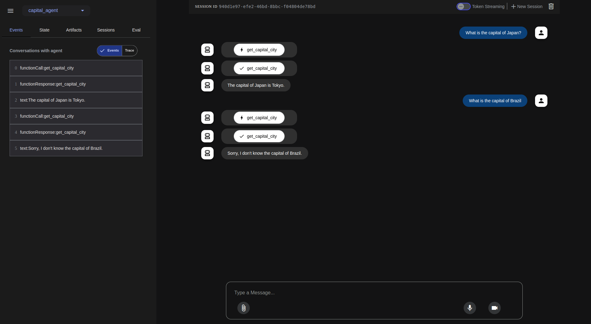

## Deploying Google Agent Development Kit (ADK) Agents on Google Kubernetes Engine (GKE)

This tutorial guides you through deploying a containerized agent built with the [Google Agent Development Kit (ADK)](https://google.github.io/adk-docs/) to [Google Kubernetes Engine (GKE)](https://cloud.google.com/kubernetes-engine/docs/concepts/kubernetes-engine-overview). GKE provides a managed environment for deploying, managing, and scaling your containerized applications using Google infrastructure.  

## Overview

In this tutorial we will deploy a simple agent to GKE. The agent will be a FastAPI application that uses Gemini 2.0 Flash as the LLM. We will use Vertex AI as the LLM provider.

This tutorial will cover:

* Setting up your Google Cloud environment.  
* Building a container image for your agent.  
* Deploying the agent to a GKE cluster.  
* Testing your deployed agent.

## Before you begin

Ensure you have the following tools installed on your workstation  
   * [gcloud CLI](https://cloud.google.com/sdk/docs/install)  
   * [kubectl](https://kubernetes.io/docs/tasks/tools/#kubectl)  
   * [terraform](https://developer.hashicorp.com/terraform/tutorials/aws-get-started/install-cli)

If you previously installed the gcloud CLI, get the latest version by running:

```
gcloud components update
```

Ensure that you are signed in using the gcloud CLI tool. Run the following command:

```
gcloud auth application-default login
```

## Infrastructure Setup

### Clone the repository

Clone the repository with our guides and cd to the `adk/vertex/` directory by running these commands:

```
git clone https://github.com/ai-on-gke/tutorials-and-examples.git
cd tutorials-and-examples/adk/vertex
```

### Filesystem structure

```
adk/vertex/
├── terraform/    # Terraform configuration for automated deployment of an infrastructure
└── app/          # The desired structure of the final application. 
    ├── capital_agent/             # Agent's module name
    │   ├── __init__.py
    │   └── agent.py               # Your agent logic
    ├── main.py                    # FastAPI application entry point
    ├── requirements.txt           # Python dependencies
    └── Dockerfile                 # Container build instructions
```

### Enable Necessary APIs

Enable the APIs required for GKE, Artifact Registry, Cloud Build, and Vertex AI

```
gcloud services enable \
    container.googleapis.com \
    artifactregistry.googleapis.com \
    cloudbuild.googleapis.com \
    aiplatform.googleapis.com
```

## Create cluster and other resources

In this section we will use Terraform to automate the creation of infrastructure resources. For more details how it is done please refer to the terraform config in the `terraform/` folder. By default, the configuration provisions an Autopilot GKE cluster, but it can be changed to standard by setting `autopilot_cluster = false`.

It creates the following resources. For more information such as resource names and other details, please refer to the [Terraform config](https://github.com/ai-on-gke/tutorials-and-examples/tree/main/adk/vertex/terraform):

* Service Accounts:
    - Cluster IAM Service Account (derives name from a cluster name, e.g. `tf-gke-<cluster name>`) – manages permissions for the GKE cluster.
    - Application’s IAM Service Account (default name `adk-tf` and can be changed in the terraform config) – manages permissions for the deployed application to access:
        - [VertexAI](https://cloud.google.com/vertex-ai/docs) LLM model.
* [Artifact registry](https://cloud.google.com/artifact-registry/docs/overview) – stores container images for the application.  
    

1. Go the the terraform directory:

    ```bash
    cd terraform
    ``` 

2. Specify the following values inside the `default_env.tfvars` file (or make a separate copy):  
   * `<PROJECT_ID>` – replace with your project id (you can find it in the project settings).

    Other values can be changed, if needed, but can be left with default values.

3. Init terraform modules:

    ```bash
    terraform init
    ``` 

4. Optionally run the plan command to view an execution plan:
    
    ```bash
    terraform plan -var-file=default_env.tfvars
    ```

5. Execute the plan:

    ```bash
    terraform apply -var-file=default_env.tfvars
    ```

    And you should see your resources created:

    ```
    Apply complete! Resources: 16 added, 0 changed, 0 destroyed.
    
    Outputs:
    
    gke_cluster_location = "us-central1"
    gke_cluster_name = "adk-tf"
    image_repository_full_name = "us-docker.pkg.dev/<PROJECT ID>/adk-tf"
    image_repository_location = "us"
    image_repository_name = "adk-tf"
    k8s_service_account_name = "adk-tf"
    project_id = <PROJECT ID>
    ```

6. Configure your kubectl context:

    ```bash
    gcloud container clusters get-credentials $(terraform output -raw gke_cluster_name) --region $(terraform output -raw gke_cluster_location)
    ```

## Deploy and Configure the Agent Application

1. Create the `app/main.py` file. This file sets up the FastAPI application using `get_fast_api_app()` from ADK.  

    ```python
    import os
    
    import uvicorn
    from fastapi import FastAPI
    from google.adk.cli.fast_api import get_fast_api_app
    
    # Get the directory where main.py is located
    AGENT_DIR = os.path.dirname(os.path.abspath(__file__))
    # Example session service URI (e.g., SQLite)
    SESSION_SERVICE_URI = "sqlite:///./sessions.db"
    # Example allowed origins for CORS
    ALLOWED_ORIGINS = ["http://localhost", "http://localhost:8080", "*"]
    # Set web=True if you intend to serve a web interface, False otherwise
    SERVE_WEB_INTERFACE = True
    
    # Call the function to get the FastAPI app instance
    # Ensure the agent directory name ('capital_agent') matches your agent folder
    app: FastAPI = get_fast_api_app(
        agents_dir=AGENT_DIR,
        session_service_uri=SESSION_SERVICE_URI,
        allow_origins=ALLOWED_ORIGINS,
        web=SERVE_WEB_INTERFACE,
    )
    
    # You can add more FastAPI routes or configurations below if needed
    # Example:
    # @app.get("/hello")
    # async def read_root():
    #     return {"Hello": "World"}
    
    if __name__ == "__main__":
        # Use the PORT environment variable provided by Cloud Run, defaulting to 8080
        uvicorn.run(app, host="0.0.0.0", port=int(os.environ.get("PORT", 8080)))
    ```

2. Create agent files.

   When finished, your agent code has to meet these requirements:
    * Agent code is in a file called `agent.py` within your agent directory.  
    * Your agent variable is named `root_agent`.  
    * `__init__.py` is within your agent directory and contains `from . import agent`.

        2.1. Create the `app/capital_agent/agent.py` file:

        ```python
        from google.adk.agents import LlmAgent
        
        # Define a tool function
        def get_capital_city(country: str) -> str:
          """Retrieves the capital city for a given country."""
          # Replace with actual logic (e.g., API call, database lookup)
          capitals = {"france": "Paris", "japan": "Tokyo", "canada": "Ottawa"}
          return capitals.get(country.lower(), f"Sorry, I don't know the capital of {country}.")
        
        
        capital_agent = LlmAgent(
            model="gemini-2.0-flash",
            name="capital_agent",
            description="Answers user questions about the capital city of a given country.",
            instruction="""You are an agent that provides the capital city of a country.
                     When a user asks for the capital of a country:
                     1. Identify the country name from the user's query.
                     2. Use the `get_capital_city` tool to find the capital.
                     3. Respond clearly to the user, stating the capital city.
                     Example Query: "What's the capital of France?"
                     Example Response: "The capital of France is Paris."
                """,
            tools=[get_capital_city] # Provide the function directly
        )
        
        root_agent = capital_agent
        ```

        2.2. Create `app/capital_agent/__init__.py` file:
    
        ```python
        from . import agent
        ```

4. Create `app/requirements.txt` file with necessary Python packages:

    ```python
    google_adk>=0.1.0
    fastapi>=0.95.0
    uvicorn>=0.22.0
    pydantic>=2.0.0
    ```

4. Create `app/Dockerfile` to build app container image:

    ```Dockerfile
    FROM python:3.13-slim
    WORKDIR /app

    RUN adduser --disabled-password --gecos "" myuser

    COPY requirements.txt .
    RUN pip install --no-cache-dir -r requirements.txt


    COPY --chown=myuser:myuser . .

    ENV PATH="/home/myuser/.local/bin:$PATH"

    USER myuser

    CMD ["sh", "-c", "uvicorn main:app --host 0.0.0.0 --port $PORT"]
    ```

5. Build and Push the Container Image

    Build your Docker image using Google Cloud Build and push it to the Artifact Registry repository that is created by the Terraform:

    ```bash
    gcloud builds submit \
        --tag $(terraform output -raw image_repository_full_name)/adk-agent:latest \
        --project=$(terraform output -raw project_id) \
        ../app
    ```

6. Run this command to create `app/deployment.yaml` file with Kubernetes Manifest. This command has to create manifest with values taken from the terraform:

    ```bash
    cat <<  EOF > ../app/deployment.yaml
    apiVersion: apps/v1
    kind: Deployment
    metadata:
      name: adk-agent
    spec:
      replicas: 1
      selector:
        matchLabels:
          app: adk-agent
      template:
        metadata:
          labels:
            app: adk-agent
        spec:
          serviceAccount: $(terraform output -raw k8s_service_account_name)
          containers:
          - name: adk-agent
            imagePullPolicy: Always
            image: $(terraform output -raw image_repository_full_name)/adk-agent:latest
            resources:
              limits:
                memory: "256Mi"
                cpu: "500m"
                ephemeral-storage: "128Mi"
              requests:
                memory: "256Mi"
                cpu: "500m"
                ephemeral-storage: "128Mi"
            ports:
            - containerPort: 8080
            env:
              - name: PORT
                value: "8080"
              - name: GOOGLE_CLOUD_PROJECT
                value: $(terraform output -raw project_id)
              - name: GOOGLE_CLOUD_LOCATION
                value: $(terraform output -raw gke_cluster_location)
              - name: GOOGLE_GENAI_USE_VERTEXAI
                value: "true"
            readinessProbe:
              httpGet:
                path: /
                port: 8080
              initialDelaySeconds: 10
              periodSeconds: 10
              timeoutSeconds: 5
              failureThreshold: 5
              successThreshold: 1
    ---
    apiVersion: v1
    kind: Service
    metadata:
      name: adk-agent
    spec:       
      type: ClusterIP
      ports:
        - port: 80
          targetPort: 8080
      selector:
        app: adk-agent
    EOF
    ```

7. Apply the manifest:

    ```bash
    kubectl apply -f ../app/deployment.yaml
    ```

8. Wait for deployment to be completed. It may take some time:

    ```bash
    kubectl rollout status deployment/adk-agent
    ```

## Testing your Deployed Agent

1. Forward port of the deployed application service:

    ```bash
    kubectl port-forward svc/adk-agent 8080:80
    ```

2. Go to the [http://localhost:8080/](http://localhost:8080/) and test the web UI. You can test your agent by simply navigating to the kubernetes service URL in your web browser.

    The ADK dev UI allows you to interact with your agent, manage sessions, and view execution details directly in the browser.
    
    To verify your agent is working as intended, you can:
    
    1. Select your agent from the dropdown menu.  
    2. Type a message and verify that you receive an expected response from your agent.
    
    
    
    As you can see from the screenshot, the agent works as expected and gives answers only for cities that are listed in the tool function.
    
    If you experience any unexpected behavior, check the pod logs for your agent using:

    ```bash
    kubectl logs -l app=adk-agent
    ```

## Troubleshooting

These are some common issues you might encounter when deploying your agent to GKE:

### 403 Permission Denied for Gemini 2.0 Flash

This usually means that the Kubernetes service account does not have the necessary permission to access the Vertex AI API. Ensure that you have created the service account and bound it to the Vertex AI User role as described in the Configure Kubernetes Service Account for Vertex AI section. If you are using AI Studio, ensure that you have set the GOOGLE\_API\_KEY environment variable in the deployment manifest and it is valid.

### Attempt to write a readonly database

You might see there is no session id created in the UI and the agent does not respond to any messages. This is usually caused by the SQLite database being read-only. This can happen if you run the agent locally and then create the container image which copies the SQLite database into the container. The database is then read-only in the container.

```bash
sqlalchemy.exc.OperationalError: (sqlite3.OperationalError) attempt to write a readonly database
[SQL: UPDATE app_states SET state=?, update_time=CURRENT_TIMESTAMP WHERE app_states.app_name = ?]

```

To fix this issue, you can either:

Delete the SQLite database file from your local machine before building the container image. This will create a new SQLite database when the container is started.

```bash
rm -f sessions.db
```

or (recommended) you can add a .dockerignore file to your project directory to exclude the SQLite database from being copied into the container image.

Build the container image and deploy the application again.

## Cleaning up

1. Destroy the provisioned infrastructure.

    ```bash
    terraform destroy -var-file=default_env.tfvars
    ```
