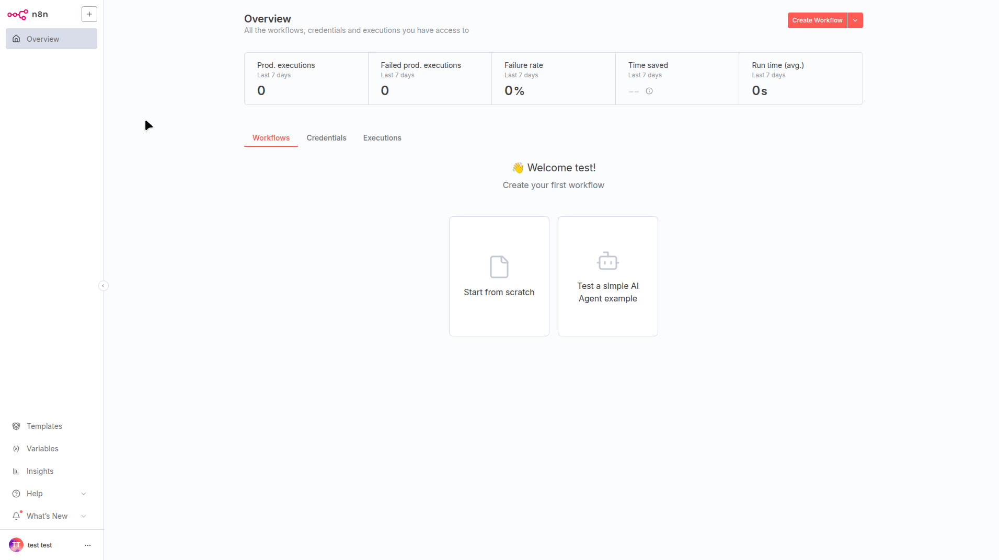
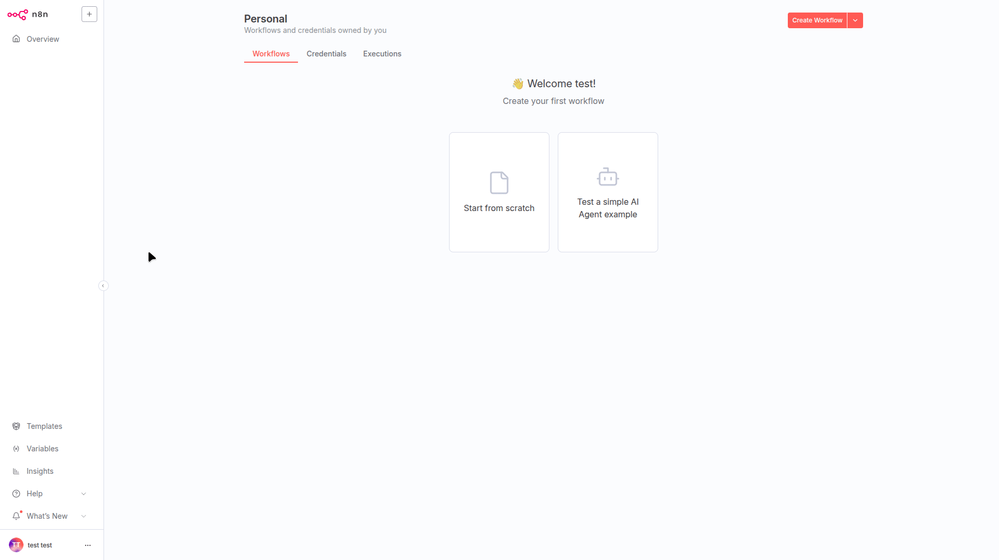
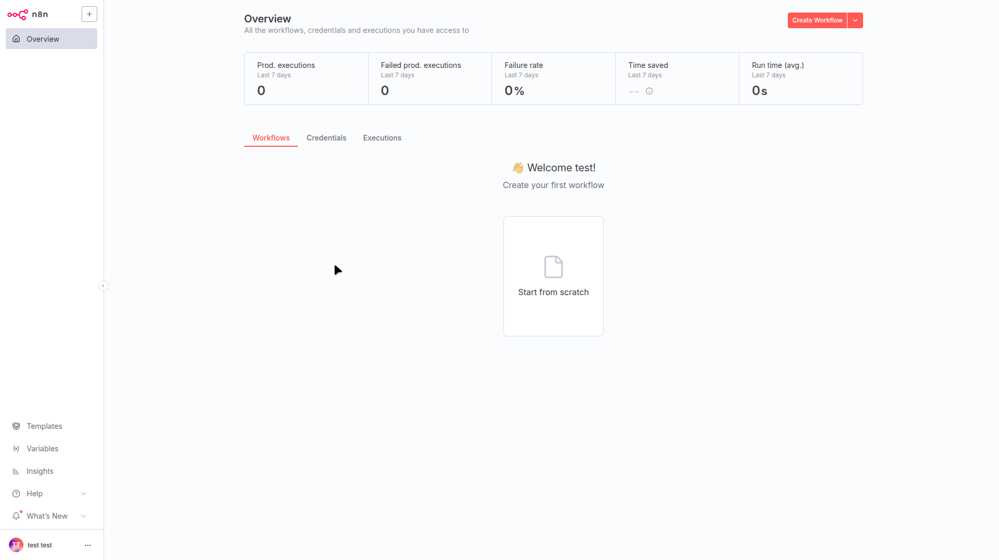
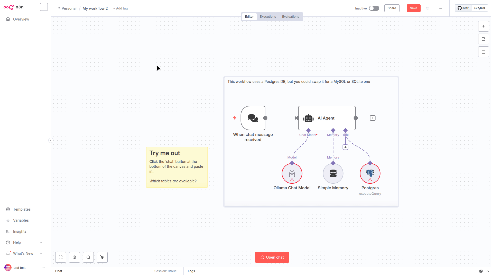
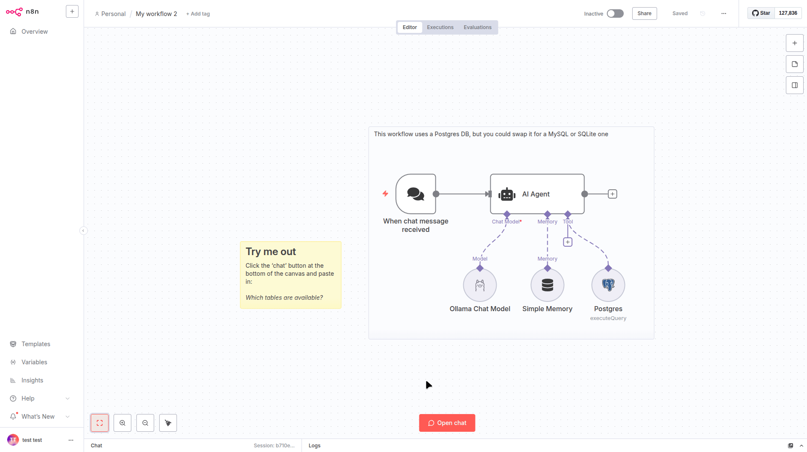

This tutorial will provide instructions on how to deploy and use [n8n](httpshttps://n8n.io/) on GKE (Google Kubernetes Engine) to build and operate AI applications using a low-code/no-code approach.

## Overview

This tutorial is designed for developers and platform engineers interested in leveraging [n8n](https://n8n.io/) on GKE for building and hosting powerful workflow automations. By deploying n8n on a managed GKE cluster, you can offload resource-intensive automation tasks, ensure high availability, and scale your automation capabilities without managing underlying server infrastructure.

N8n is a workflow automation tool that enables you to connect and automate different software services through a visual, node-based interface. In this guide, we will create a n8n deployment backed by a managed PostgreSQL database on Cloud SQL. This setup provides a scalable and resilient foundation for your automation workflows.

### What you will learn

1. **Provision required infrastructure automatically using Terraform**: This includes a GKE Autopilot cluster and a CloudSQL for PostgreSQL instance.  
2. **Install n8n on the GKE cluster**: We will use a community-maintained Helm chart for a standardized and repeatable deployment.  
3. **Build a sample workflow**: You'll create and run a “Chat with a Database” workflow to verify that your n8n instance is fully operational.

### Filesystem structure

For this tutorial, we will use the following file structure:

```
├── terraform	# Terraform config
│   ├── bucket.tf
│   ├── cloudsql.tf
│   ├── example.tfvars
│   ├── main.tf
│   ├── network.tf
│   ├── outputs.tf
│   ├── templates.tf
│   └── variables.tf
├── gen	       # This directory contains files that are generated from templates by the terraform.
├── templates  # Templates for files to be generated by  the terraform
│   ├── n8n
│   │   ├── common-values.yaml.tftpl
│   │   └── service-type.yaml.tftpl
│   └── ollama
│       └── ollama.yaml.tftpl
└── workflow.json # n8n sample workflow

```

## Before you begin

1. Ensure you have a GCP project with billing enabled and [enable the GKE API](https://cloud.google.com/kubernetes-engine/docs/how-to/enable-gkee).  
2. Ensure you have the following tools installed on your workstation  
   * [gcloud CLI](https://cloud.google.com/sdk/docs/install)  
   * [kubectl](https://kubernetes.io/docs/tasks/tools/#kubectl)  
   * [terraform](https://developer.hashicorp.com/terraform/tutorials/aws-get-started/install-cli)  
   * [helm](https://helm.sh/docs/intro/install/)

If you previously installed the gcloud CLI, get the latest version by running:

```shell
gcloud components update
```

Ensure that you are signed in using the gcloud CLI tool. Run the following command:

```shell
gcloud auth application-default login
```

## Infrastructure Setup

### Clone the repository

Clone the repository with our guides and cd to the `n8n/` directory by running these commands:

```shell
git clone https://github.com/ai-on-gke/tutorials-and-examples.git
cd tutorials-and-examples/n8n
```

### Enable Necessary APIs

Enable the APIs required for GKE, Artifact Registry, Cloud Build and Cloud Storage

```shell
gcloud services enable \
    container.googleapis.com \
    storage.googleapis.com
```

### Create cluster and other resources

In this section we will use Terraform to automate the creation of infrastructure resources. For more details how it is done, please refer to the terraform config in the `terraform/` folder. By default, the configuration provisions an Autopilot GKE cluster, but it can be changed to standard by setting `autopilot_cluster = false`.

It creates the following resources. For more information such as resource names and other details, please refer to the [Terraform config](https://github.com/ai-on-gke/tutorials-and-examples/tree/main/n8n/terraform):

* Service Accounts:  
    
  1. Cluster IAM Service Account (derives name from a cluster name, e.g. `tf-gke-<cluster name>`) – manages permissions for the GKE cluster.  
  2. Application’s IAM Service Account (default name `n8n-tf` and can be changed in the terraform config) – manages permissions for the deployed application to access:  
     * LLM models that are stored in a Cloud Storage bucket.

* Cloud Storage Bucket to store data such as LLM model.  
    
* [CloudSQL](https://cloud.google.com/sql/docs/introduction) instance to store n8n data such as chat messages, conversational context, etc. To verify that the data is persisted, you can verify it, for example, in the [CloudSQL Studio](https://cloud.google.com/sql/docs/mysql/manage-data-using-studio) after the tutorial is completed.  
    
1. Go the the terraform directory:

   ```shell
   cd terraform
   ```

2. Specify the following values inside the `example.tfvars` file (or make a separate copy):  
   `<PROJECT_ID>` – replace with your project id (you can find it in the project settings).  
     
3. Init terraform modules:

   ```shell
   terraform init
   ```

4. Optionally run the `plan` command to view an execution plan:

   ```shell
   terraform plan -var-file=example.tfvars
   ```

5. Execute the plan. This may take around 10-15 minutes to complete:

   ```shell
   terraform apply -var-file=example.tfvars
   ```

   And you should see your resources created:

   ```shell
   Apply complete! Resources: 29 added, 0 changed, 0 destroyed.
   
   Outputs:
   
   cloudsql_db_name = "n8n"
   cloudsql_db_user = "n8n"
   cloudsql_instance_ip = "<IP>"
   gke_cluster_location = "us-central1"
   gke_cluster_name = "n8n-tutorial-tf"
   project_id = "<PROJECT_ID>"
   ```

6. Configure your kubectl context:

   ```shell
   gcloud container clusters get-credentials $(terraform output -raw gke_cluster_name) --region $(terraform output -raw gke_cluster_location) --project $(terraform output -raw project_id)
   ```

## Deploy the Ollama to serve LLMs

We deploy an Ollama server to host LLM that we will use in n8n. 

1. Apply the Kubernetes manifest file `gen/ollama.yaml`  that is previously generated from the template by the terrafrom 

   ```shell
   kubectl apply -f ../gen/ollama.yaml
   ```

2. Wait for Ollama is successfully deployed:

   ```shell
   kubectl rollout status deployment/ollama
   ```

3. Pull the  `llama3.2` model within Ollama server pod:

   ```shell
   kubectl exec $(kubectl get pod -l app=ollama -o name) -c ollama -- ollama pull llama3.2
   ```

## N8n Deployment and Configuration

1. Install the n8n helm chart by running the next command:
     
   ```shell
   helm install n8n oci://8gears.container-registry.com/library/n8n \
   --version 1.0.10 \
   -f ../gen/n8n-common-values.yaml \
   -f ../gen/n8n-service-type-<SERVICE_TYPE>.yaml
   ```
   
   For the file `n8n-service-type-<SERVICE_TYPE>.yaml` you must replace the `<SERVICE_TYPE>` with an appropriate value in order to create the desired type of a service that exposes the n8n web UI:  
      * `n8n-service-type-nodeport.yaml` \- Creates a NodePort service with an external IP . Use this if you want to expose it though Identity Aware Proxy later in the guide.  
      *  `n8n-service-type-clusterip.yaml` \- Creates a ClisterIP service without external IP. Use this if you just want to test it locally by using the `kubectl port-forward` command.
      
2. Wait the completion of the deployment:

   ```shell
   kubectl rollout status deployment/n8n
   ```

   You can have a look at the running pods to verify that everything is deployed:

   ```
   kubectl get pods
   ```

   There have to be pods for Ollama and n8n and the output should be similar to:

   ```
   NAME                       READY   STATUS    RESTARTS      AGE
   n8n-5c89d977b7-9lnw8       1/1     Running   0             24m
   ollama-87557bbf4-5pk98     2/2     Running   0             30m
   ```

   You can also verify that the respective services are created:

   ```
   kubectl get svc
   ```

   The output should be similar to:

   ```
   NAME         TYPE        CLUSTER-IP       EXTERNAL-IP   PORT(S)     AGE
   n8n          NodePort    <SOME_IP>        <none>        3000:31935/TCP   3m17s
   kubernetes   ClusterIP   34.118.224.1     <none>        443/TCP          32m
   ollama       ClusterIP   34.118.237.109   <none>        11434/TCP        8m35s
   ```

### Securely expose n8n Web-UI with Identity Aware Proxy.

1. Create a new directory for Terraform config:

   ```shell
   mkdir ../iap
   ```

2. Prepare the tfvars file that will be needed during the IAP guide. Run this command, to automatically  specify some of the known variable values, so you only need to specify the remaining ones with the `<>` placeholder.

   ```shell
   cat <<EOF > ../iap/values.tfvars
   project_id               = "$(terraform output -raw project_id)"
   cluster_name             = "$(terraform output -raw gke_cluster_name)"
   cluster_location         = "$(terraform output -raw gke_cluster_location)"
   app_name                 = "n8n"
   k8s_namespace            = "$(kubectl get svc n8n -o=jsonpath='{.metadata.namespace}')"
   k8s_backend_service_name = "$(kubectl get svc n8n -o=jsonpath='{.metadata.name}')"
   k8s_backend_service_port = "$(kubectl get svc n8n -o=jsonpath='{.spec.ports[0].port}')"
   support_email            = "<SUPPORT_EMAIL>"
   client_id                = "<CLIENT_ID>"
   client_secret            = "<CLIENT_SECRET>"
   members_allowlist        = [<MEMBERS_ALLOWLIST>]
   EOF
   ```

3. Go to the newly created directory:

   ```shell
   cd ../iap
   ```

4. Navigate to the [Secure your app with Identity Aware Proxy guide](/docs/tutorials/security/identity-aware-proxy) and follow the instructions to enable IAP.

### [Alternative] Use Port-forward

As an alternative, for a local testing, instead of IAP you can use the port-forward command:

   ```shell
   kubectl port-forward svc/n8n 8000:80
   ```

## Trying example workflow with the Database Chat Example Workflow 

In the example we create a workflow that uses LLMs from the Ollama service that we deployed earlier on the GKE cluster alongside the n8n. All nodes of the example workflow use only locally deployed LLMs that are served by Ollama.

The example itself is a workflow based on [this template](https://n8n.io/workflows/2090-chat-with-a-database-using-ai/) that uses an agent to interact with a database. In this example the target database is n8n’s database itself.

1. Create Ollama credentials to connect to the Ollama server that we deployed earlier. In the `Base URL` field use name of the Ollama Kubernetes service: 

   

2. Fetch IP of our CloudSQL instance:

   ```shell
   terraform output -raw cloudsql_instance_ip
   ```

3. Get password of the n8n database:  

   ```shell
   kubectl get secret db-secret -o=json | jq ".data.password" -r | base64 -d
   ```

4. Create Postgres credentials to connect to our PostgreSQL server. Create a new credential with the Postgres type and fill the next values:  
   * Host \- *CloudSQL instance IP that we obtained earlier.*  
   * Database \- `n8n`  
   * User \- `n8n`  
   * Password \- *Password that we obtained earlier (Do not use IP from the picture)*

   

5. Create a new workflow and import our sample workflow from the `workflow.json`  file: 

   

6. Specify previously created Ollama and Postgres credentials in the respective nodes and save the workflow:

   

7. Do some prompting to test the workflow:

   

	The agent should use the Postgres tool in order to fulfill the prompt. You can see the detailed logs on the right side from the chat.

## Cleaning up

1. Destroy the provisioned infrastructure.

   ```shell
   terraform destroy -var-file=example.tfvars
   ```
