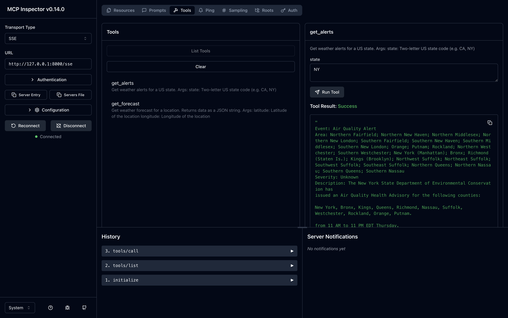
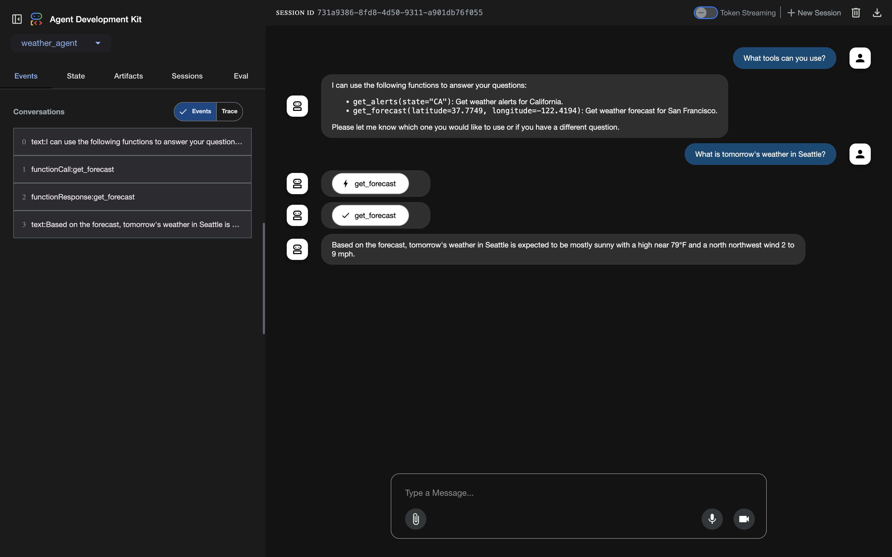

# Ray cluster with ADK and a custom MCP server

## Introduction
This guide shows how to host a Model Context Protocol (MCP) server with Server Sent Events (SSE) transport on Google Kubernetes Engine (GKE), along with guidance for authenticating MCP clients. MCP is an open protocol that standardizes how AI agents interact with their environment and external data sources. MCP clients can communicate with the MCP servers using two distinct transport mechanisms:
Standard Input/Output (stdio) - Direct process communication
Server Sent Events (SSE) or Streamable HTTP - web-based streaming communication

## Before you begin

Ensure you have the following tools installed on your workstation
   * [gcloud CLI](https://cloud.google.com/sdk/docs/install)
   * [kubectl](https://kubernetes.io/docs/tasks/tools/#kubectl)
   * [terraform](https://developer.hashicorp.com/terraform/tutorials/aws-get-started/install-cli)
   * [Helm](https://helm.sh/docs/intro/install/)

If you previously installed the gcloud CLI, get the latest version by running:

```
gcloud components update
```

Ensure that you are signed in using the gcloud CLI tool. Run the following command:

```
gcloud auth application-default login
```

### You have several options for deploying MCP:
#### Local Development
Host both MCP clients and servers on the same local machine

#### Hybrid Setup
Run an MCP client locally and have it communicate with remote MCP servers hosted on a cloud platform like GKE

#### Full Cloud Deployment
Host both MCP clients and servers on a cloud platform.

> Important Note: while GKE supports hosting MCP servers with stdio transport (through multi-container pods or sidecar patterns), streamable HTTP transport is the recommended approach for Kubernetes deployments. HTTP-based transport aligns better with Kubernetes networking principles, enables independent scaling of components, and provides better observability and debugging capabilities.

### MCP server Development
You have two main approaches for implementing an MCP server:
- Develop a custom MCP server using official SDKs or third-party frameworks (like FastMCP).
- Use exisiting MCP servers: browse the official MCP servers GitHub repository, curated MCP servers available on Docker Hub, etc.

## Overview:
[In the tutorial with adk and vllm](https://ai-on-gke-website.uc.r.appspot.com/docs/agentic/adk-llama-vllm/), we successfully built a weather agent. However, the weather agent cannot answer questions such as "What's tomorrow's weather in Seattle" because it lacks access to a live weather data source. In this tutorial, we'll address this limitation by building and deploying a custom MCP server using FastMCP. This server will provide our agent with real-time weather capabilities and will be deployed on GKE. We will continue to use the same LLM backend powered by RayServe/vLLM ([per Ray Serve for Self-Hosted LLMs tutorial](https://ai-on-gke-website.uc.r.appspot.com/docs/agentic/ray-serve/)).

Folder structure:
```
tutorials-and-examples/adk/ray-mcp/
├── ray-serve-vllm
│   ├── ray-service.yaml
│   └── serve-chat-completion.py
│   └── Dockerfile
│   └── requirements.txt
│
└── adk_agent
│  └── weather_agent
│  │   ├── __init__.py
│  │   ├── weather_agent.py
│  │   └── deployment_agent.yaml
│  ├── main.py
│  └── requirements.txt
│  └── Dockerfile
│
└── mcp_server
│  ├── weather_mcp.py
│  └── deployment_weather_mcp.yaml
│  └── Dockerfile
│  └── requirements.txt
│
└── mcp_server
    ├── artifact_registry.tf
    └── main.tf
    └── outputs.tf
    └── variables.tf
    └── default_env.tfvars
    └── network.tf
    └── providers.tf
    └── workload_identity.tf
```

## Step 1: Set Up the Infrastructure with Terraform

Start by setting up the GKE cluster, service account, IAM roles, and Artifact Registry using Terraform.

Download the code and navigate to the tutorial directory:

```bash
git clone https://github.com/ai-on-gke/tutorials-and-examples.git
cd tutorials-and-examples/adk/ray-mcp/terraform
```

Set the environment variables, replacing `<PROJECT_ID>` and `<MY_HF_TOKEN>`:

```bash
gcloud config set project <PROJECT_ID>
export PROJECT_ID=$(gcloud config get project)
export REGION=us-central1
export HF_TOKEN=<MY_HF_TOKEN>
export CLUSTER_NAME=llama-ray-cluster
```

Update the <PROJECT_ID> placeholder in `default_env.tfvars` with your own Google Cloud Project ID Name.

Initialize Terraform, inspect plan and apply the configuration:

```bash
terraform init
terraform plan --var-file=./default_env.tfvars
terraform apply --var-file=./default_env.tfvars
```

Review the plan and type yes to confirm. This will create:

- A GKE Autopilot cluster named `llama-ray-cluster`.
- A service account `adk-ray-agent-sa`.
- An IAM role binding granting the service account `roles/artifactregistry.reader`.
- An Artifact Registry repository `llama-ray-mcp`.

Configure `kubectl` to communicate with the cluster:

```bash
gcloud container clusters get-credentials $CLUSTER_NAME --region=$REGION --project $PROJECT_ID
```

Create a Kubernetes secret for the Hugging Face token:

```bash
kubectl create secret generic hf-secret \
  --from-literal=hf_api_token=$HF_TOKEN \
  --dry-run=client -o yaml | kubectl apply -f -
```

## Step 2: Containerize and Deploy the Ray Serve Application

Build and push the container image for the Ray Serve application to Artifact Registry.

Navigate to the ray-serve-vllm directory:

```bash
cd ../ray-serve-vllm
```

Build and push the container image:

```bash
gcloud builds submit \
    --tag us-docker.pkg.dev/$PROJECT_ID/llama-ray-mcp/llama-ray-serve:latest \
    --project=$PROJECT_ID \
    .
```

Deploy the Ray Serve application:

1. Open the `ray-service.yaml` file in the `ray-serve-vllm` directory.
2. Replace `<PROJECT_ID>` with your Google Cloud project name.
3. Install kuberay-operator via Helm:

```bash
# Add the Helm repo
helm repo add kuberay https://ray-project.github.io/kuberay-helm/
helm repo update

# Confirm the repo exists
helm search repo kuberay --devel

# Install both CRDs and KubeRay operator v1.3.2.
helm install kuberay-operator kuberay/kuberay-operator --version 1.3.2

# Check the KubeRay operator Pod in `default` namespace
kubectl get pods
# NAME                                READY   STATUS    RESTARTS   AGE
# kuberay-operator-6fcbb94f64-mbfnr   1/1     Running   0          17s
```

4. Apply the manifest:
```bash
kubectl apply -f ray-service.yaml
```

Verify the deployment:

- Check the Ray service status:
```bash
kubectl get rayservice llama-31-8b -o yaml
```

The `serviceStatus` should be `running`.

- Check the raycluster:
```bash
kubectl get raycluster
```

And you should see output similar to this:
```log
NAME                           DESIRED WORKERS   AVAILABLE WORKERS   CPUS   MEMORY   GPUS   STATUS   AGE
llama-31-8b-raycluster-qgzmk   1                 1                   10     33Gi     2      ready    58m
```

- Check the pods:
```bash
kubectl get pods
```

You should see two pods: one Ray Head Pod and one Ray Worker Pod where Worker pods run the LLM and allow for scaling as the requests grow in volume and Head pod is used for management and should stay at a single replica.
```log
NAME                                                  READY   STATUS    RESTARTS   AGE
kuberay-operator-bb8d4d9c4-7h2vg                      1/1     Running   0          9m33s
llama-31-8b-raycluster-w9jzw-gpu-group-worker-9l5zx   1/1     Running   0          9m7s
llama-31-8b-raycluster-w9jzw-head-45rx4               1/1     Running   0          9m8s
```

- Check the config map for the chat template:

```bash
kubectl get configmaps
```

Which should display output similar to:
```bash
NAME                   DATA   AGE
kube-root-ca.crt       1      4h47m
llama-chat-templates   1      3h18m
```
### Test the Ray Serve Deployment

Test the model by setting up port forwarding and sending requests.

Set up port forwarding to the Ray Serve endpoint:

```bash
kubectl port-forward service/llama-31-8b-serve-svc 8000:8000
```

Send a weather query that requires tool usage:

```bash
curl http://127.0.0.1:8000/v1/chat/completions \
-X POST \
-H "Content-Type: application/json" \
-d '{
    "model": "meta-llama/Llama-3.1-8B-Instruct",
    "messages": [
        {
          "role": "user",
          "content": "What is the weather in New York today?"
        }
    ],
    "tools": [
        {
          "type": "function",
          "function": {
            "name": "get_weather",
            "description": "Get the current weather for a city",
            "parameters": {
              "type": "object",
              "properties": {
                "city": {
                  "type": "string",
                  "description": "The city name"
                }
              },
              "required": ["city"]
            }
          }
        }
    ]
}' | jq
```

The response should include a tool call to `get_weather` with the parameter `city: "New York"`, and the `"finish_reason"` should be `"tool_calls"`. And the response should contain something like this:

```log
{
  "id": "chatcmpl-a7569e70-c904-40cb-9aad-a1c5944fc503",
  "object": "chat.completion",
  "created": 1749044680,
  "model": "meta-llama/Llama-3.1-8B-Instruct",
  "choices": [
    {
      "index": 0,
      "message": {
        "role": "assistant",
        "reasoning_content": null,
        "content": null,
        "tool_calls": [
          {
            "id": "chatcmpl-tool-7d85f9313e2e4d76904a3ae2d76c69ac",
            "type": "function",
            "function": {
              "name": "get_weather",
              "arguments": "{\"city\": \"New York\"}"
            }
          }
        ]
      },
      "logprobs": null,
      "finish_reason": "tool_calls",
      "stop_reason": 128008
    }
  ],
  "usage": {
    "prompt_tokens": 254,
    "total_tokens": 273,
    "completion_tokens": 19,
    "prompt_tokens_details": null
  },
  "prompt_logprobs": null
}
```

Once you ensure that everything is okay, terminate the port-forward.

## Step 3: Deploy the MCP server

Navigate to the MCP Server directory:

```bash
cd ../mcp_server
```

Build and push the MCP Server container image:

```bash
gcloud builds submit \
    --tag us-docker.pkg.dev/$PROJECT_ID/llama-ray-mcp/mcp-server:latest \
    --project=$PROJECT_ID \
    .
```

Update the `./deployment_weather_mcp.yaml` file `<PROJECT_ID>` placeholders where applicable. Apply the manifest:
```bash
kubectl apply -f deployment_weather_mcp.yaml
```

Validate your MCP Server by running this command:
```bash
npx @modelcontextprotocol/inspector
```

You should see this output in the terminal:
```log
Starting MCP inspector...
⚙️ Proxy server listening on port 6277r
🔍 MCP Inspector is up and running at http://127.0.0.1:6274 🚀
```

To validate our MCP Server, we can use MCP Inspector. Let's port-forward our MCP Server and launch the inspector. Run this command to port-forward the MCP Server:
```bash
kubectl port-forward svc/weather-mcp-server 8000:8080
```

And in another terminal session run this command:
```bash
npx @modelcontextprotocol/inspector
```

You should see this output:
```
Starting MCP inspector...
⚙️ Proxy server listening on port 6277
New SSE connection. NOTE: The sse transport is deprecated and has been replaced by streamable-http
Query parameters: [Object: null prototype] {
  url: 'http://127.0.0.1:8000/sse',
  transportType: 'sse'
}
SSE transport: url=http://127.0.0.1:8000/sse, headers=Accept
Connected to SSE transport
Connected MCP client to backing server transport
Created client transport
Created server transport
Set up MCP proxy
🔍 MCP Inspector is up and running at http://127.0.0.1:6274 🚀
```

> Note: if the inspector didn't see your MCP Server, you can specify it manually in the UI.

In the UI press the `Connect` button, and navigate to the `tools` tab. Here you can push the `List Tools` button and check how these tools work.


Now you can cancel the port-forwarding and close the inspector.

## Step 4: Deploy the ADK Agent

Navigate to the ADK agent directory:

```bash
cd ../adk_agent
```

Build and push the ADK agent container image:

```bash
gcloud builds submit \
    --tag us-docker.pkg.dev/$PROJECT_ID/llama-ray-mcp/adk-agent:latest \
    --project=$PROJECT_ID \
    .
```

Update the `./deployment_agent.yaml` file `<PROJECT-ID>` placeholders where applicable. Apply the manifest:

```bash
kubectl apply -f ./deployment_agent.yaml
```

Verify the deployment:

- Check the pods:

```bash
kubectl get pods
```

You should see three pods: the two Ray pods and the ADK agent pod.
```bash
NAME                                                  READY   STATUS    RESTARTS       AGE
adk-agent-6c8488db64-hjt86                            1/1     Running   0              61m
kuberay-operator-bb8d4d9c4-kwjml                      1/1     Running   2 (177m ago)   3h1m
llama-31-8b-raycluster-v8vj4-gpu-group-worker-ttfp7   1/1     Running   0              162m
llama-31-8b-raycluster-v8vj4-head-ppt6t               1/1     Running   0              162m
weather-mcp-server-79748fd6b5-8h4m7                   1/1     Running   0              43m
```
- Check the services:

```bash
kubectl get services
```

You should see seven services, including the ADK service.

```bash
NAME                                    TYPE        CLUSTER-IP       EXTERNAL-IP   PORT(S)                                         AGE
adk-agent                               ClusterIP   34.118.235.225   <none>        80/TCP                                          64m
kuberay-operator                        ClusterIP   34.118.236.198   <none>        8080/TCP                                        3h5m
kubernetes                              ClusterIP   34.118.224.1     <none>        443/TCP                                         3h40m
llama-31-8b-head-svc                    ClusterIP   None             <none>        10001/TCP,8265/TCP,6379/TCP,8080/TCP,8000/TCP   153m
llama-31-8b-raycluster-v8vj4-head-svc   ClusterIP   None             <none>        10001/TCP,8265/TCP,6379/TCP,8080/TCP,8000/TCP   165m
llama-31-8b-serve-svc                   ClusterIP   34.118.233.111   <none>        8000/TCP                                        153m
weather-mcp-server                      ClusterIP   34.118.239.33    <none>        8080/TCP                                        46m
```

Access your ADK Agent using port-forwarding:

```bash
kubectl port-forward svc/adk-agent 8000:80
```

You should see the following output:
```log
Forwarding from 127.0.0.1:8000 -> 8080
Forwarding from [::1]:8000 -> 8080
```

Follow the http://127.0.0.1:8000 and test your agent.


## Step 5: Clean Up
Destroy the provisioned infrastructure.
```bash
terraform destroy -var-file=default_env.tfvars
```
