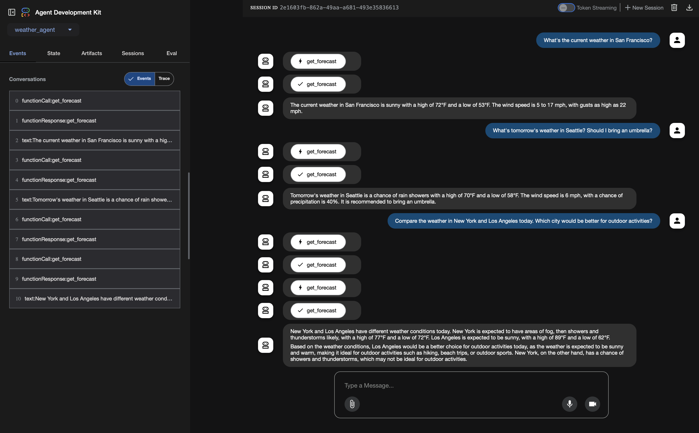

## Introduction
This guide shows how to host a [Model Context Protocol (MCP)](https://modelcontextprotocol.io/introduction) server with Server Sent Events (SSE) transport on Google Kubernetes Engine (GKE), along with guidance for authenticating MCP clients. MCP is an open protocol that standardizes how AI agents interact with their environment and external data sources. MCP clients can communicate with the MCP servers using two distinct transport mechanisms:
   * [Standard Input/Output (stdio)](https://modelcontextprotocol.io/docs/concepts/transports#standard-input%2Foutput-stdio) - Direct process communication
   * [Server Sent Events (SSE)](https://modelcontextprotocol.io/specification/2025-03-26/basic/transports#streamable-http) or Streamable HTTP - web-based streaming communication

### You have several options for deploying MCP:
1. Local Development: Host both MCP clients and servers on the same local machine

2. Hybrid Setup: Run an MCP client locally and have it communicate with remote MCP servers hosted on a cloud platform like GKE

3. Full Cloud Deployment: Host both MCP clients and servers on a cloud platform.

> Important Note: while GKE supports hosting MCP servers with stdio transport (through multi-container pods or sidecar patterns), streamable HTTP transport is the recommended approach for Kubernetes deployments. HTTP-based transport aligns better with Kubernetes networking principles, enables independent scaling of components, and provides better observability and debugging capabilities.

## Before you begin

Ensure you have the following tools installed on your workstation
   * [gcloud CLI](https://cloud.google.com/sdk/docs/install)
   * [kubectl](https://kubernetes.io/docs/tasks/tools/#kubectl)
   * [terraform](https://developer.hashicorp.com/terraform/tutorials/aws-get-started/install-cli)
   * [Helm](https://helm.sh/docs/intro/install/)
   * [NodeJS](https://nodejs.org/en/download)

If you previously installed the gcloud CLI, get the latest version by running:

```
gcloud components update
```

Ensure that you are signed in using the gcloud CLI tool. Run the following command:

```
gcloud auth application-default login
```

### MCP server Development
You have two main approaches for implementing an MCP server:
- Develop a custom MCP server using official SDKs or third-party frameworks (like FastMCP).
- Use existing MCP servers: browse the official MCP servers GitHub repository, curated MCP servers available on Docker Hub, etc.

## Overview:
[In the tutorial with adk and vllm](https://gke-ai-labs.dev/docs/agentic/adk-llama-vllm/), we successfully built a weather agent. However, the weather agent cannot answer questions such as "What's tomorrow's weather in Seattle" because it lacks access to a live weather data source. In this tutorial, we'll address this limitation by building and deploying a custom MCP server using FastMCP. This server will provide our agent with real-time weather capabilities and will be deployed on GKE. We will continue to use the same LLM backend powered by RayServe/vLLM ([per Ray Serve for Self-Hosted LLMs tutorial](https://gke-ai-labs.dev/docs/agentic/ray-serve/)).

Folder structure:
```
tutorials-and-examples/adk/ray-mcp/
├── ray-serve-vllm
│   ├── ray-service.yaml
│   └── serve-chat-completion.py
│   └── Dockerfile
│   └── requirements.txt
│
└── adk_agent
│  └── weather_agent
│  │   ├── __init__.py
│  │   ├── weather_agent.py
│  │   └── deployment_agent.yaml
│  ├── main.py
│  └── requirements.txt
│  └── Dockerfile
│
└── mcp_server
│  ├── weather_mcp.py
│  └── deployment_weather_mcp.yaml
│  └── Dockerfile
│  └── requirements.txt
│
└── terraform
    ├── artifact_registry.tf
    └── main.tf
    └── outputs.tf
    └── variables.tf
    └── default_env.tfvars
    └── network.tf
    └── providers.tf
    └── workload_identity.tf
```

## Step 1: Set Up the Infrastructure with Terraform

Start by setting up the GKE cluster, service account, IAM roles, and Artifact Registry using Terraform.

Download the code and navigate to the tutorial directory:

```bash
git clone https://github.com/ai-on-gke/tutorials-and-examples.git
cd tutorials-and-examples/adk/ray-mcp/terraform
```

Set the environment variables, replacing `<PROJECT_ID>` and `<MY_HF_TOKEN>`:

```bash
gcloud config set project <PROJECT_ID>
export PROJECT_ID=$(gcloud config get project)
export REGION=us-central1
export HF_TOKEN=<MY_HF_TOKEN>
export CLUSTER_NAME=llama-ray-cluster
```

Update the <PROJECT_ID> placeholder in `default_env.tfvars` with your own Google Cloud Project ID Name.

Initialize Terraform, inspect plan and apply the configuration:

```bash
terraform init
terraform plan --var-file=./default_env.tfvars
terraform apply --var-file=./default_env.tfvars
```

Review the plan and type yes to confirm. This will create:

- A GKE Autopilot cluster named `llama-ray-cluster`.
- A service account `adk-ray-agent-sa`.
- An IAM role binding granting the service account `roles/artifactregistry.reader`.
- An Artifact Registry repository `llama-ray-mcp`.

Configure `kubectl` to communicate with the cluster:

```bash
gcloud container clusters get-credentials $CLUSTER_NAME --region=$REGION --project $PROJECT_ID
```

Create a Kubernetes secret for the Hugging Face token:

```bash
kubectl create secret generic hf-secret \
  --from-literal=hf_api_token=$HF_TOKEN \
  --dry-run=client -o yaml | kubectl apply -f -
```

## Step 2: Containerize and Deploy the Ray Serve Application

Follow [this tutorial](https://gke-ai-labs.dev/docs/agentic/ray-serve/) deploy your Ray Serve application. After you finish this step, our agent will connect to this Ray Serve application to invoke the LLM.

## Step 3: Deploy the MCP server

Navigate to the MCP Server directory:

```bash
cd ../mcp_server
```

Build and push the MCP Server container image:

```bash
gcloud builds submit \
    --tag us-docker.pkg.dev/$PROJECT_ID/llama-ray-mcp/mcp-server:latest \
    --project=$PROJECT_ID \
    .
```

Update the `./deployment_weather_mcp.yaml` file `<PROJECT_ID>` placeholders where applicable. Apply the manifest:
```bash
kubectl apply -f deployment_weather_mcp.yaml
```

To validate our MCP Server, we can use MCP Inspector. Let's port-forward our MCP Server and launch the inspector. Run this command to port-forward the MCP Server:
```bash
kubectl port-forward svc/weather-mcp-server 8000:8080
```

And in another terminal session run this command:
```bash
npx @modelcontextprotocol/inspector
```

You should see this output:
```log
Starting MCP inspector...
⚙️ Proxy server listening on 127.0.0.1:6277
🔑 Session token: <SESSION_TOKEN>
Use this token to authenticate requests or set DANGEROUSLY_OMIT_AUTH=true to disable auth

🔗 Open inspector with token pre-filled:
   http://localhost:6274/?MCP_PROXY_AUTH_TOKEN=<SESSION_TOKEN>
   (Auto-open is disabled when authentication is enabled)

🔍 MCP Inspector is up and running at http://127.0.0.1:6274
```

To connect to your MCP Server, you need to do the following:
   * `Transport Type` - choose `SSE`.
   * `URL` - paste `http://127.0.0.1:8000/sse`.
   * `Configutation` -> `Proxy Session Token` - paste `<SESSION_TOKEN>` from the terminal (see example logs above).

Press the `Connect` button, and navigate to the `tools` tab. Here you can push the `List Tools` button and check how these tools work.


Now you can cancel the port-forwarding and close the inspector.

## Step 4: Deploy the ADK Agent

Navigate to the ADK agent directory:

```bash
cd ../adk_agent
```

Build and push the ADK agent container image:

```bash
gcloud builds submit \
    --tag us-docker.pkg.dev/$PROJECT_ID/llama-ray-mcp/adk-agent:latest \
    --project=$PROJECT_ID \
    .
```

Update the `./deployment_agent.yaml` file `<PROJECT-ID>` placeholders where applicable. Apply the manifest:

```bash
kubectl apply -f deployment_agent.yaml
```

Verify the deployment:

- Check the pods:

    ```bash
    kubectl get pods
    ```

    You should see three pods: the two Ray pods and the ADK agent pod.
    ```bash
    NAME                                                  READY   STATUS    RESTARTS       AGE
    adk-agent-6c8488db64-hjt86                            1/1     Running   0              61m
    kuberay-operator-bb8d4d9c4-kwjml                      1/1     Running   2 (177m ago)   3h1m
    llama-31-8b-raycluster-v8vj4-gpu-group-worker-ttfp7   1/1     Running   0              162m
    llama-31-8b-raycluster-v8vj4-head-ppt6t               1/1     Running   0              162m
    weather-mcp-server-79748fd6b5-8h4m7                   1/1     Running   0              43m
    ```
- Check the services:

    ```bash
    kubectl get services
    ```

    You should see seven services, including the ADK service.

    ```bash
    NAME                                    TYPE        CLUSTER-IP       EXTERNAL-IP   PORT(S)                                         AGE
    adk-agent                               ClusterIP   34.118.235.225   <none>        80/TCP                                          64m
    kuberay-operator                        ClusterIP   34.118.236.198   <none>        8080/TCP                                        3h5m
    kubernetes                              ClusterIP   34.118.224.1     <none>        443/TCP                                         3h40m
    llama-31-8b-head-svc                    ClusterIP   None             <none>        10001/TCP,8265/TCP,6379/TCP,8080/TCP,8000/TCP   153m
    llama-31-8b-raycluster-v8vj4-head-svc   ClusterIP   None             <none>        10001/TCP,8265/TCP,6379/TCP,8080/TCP,8000/TCP   165m
    llama-31-8b-serve-svc                   ClusterIP   34.118.233.111   <none>        8000/TCP                                        153m
    weather-mcp-server                      ClusterIP   34.118.239.33    <none>        8080/TCP                                        46m
    ```

- Access your ADK Agent using port-forwarding:

    ```bash
    kubectl port-forward svc/adk-agent 8000:80
    ```

    You should see the following output:
    ```log
    Forwarding from 127.0.0.1:8000 -> 8080
    Forwarding from [::1]:8000 -> 8080
    ```

    Follow the http://127.0.0.1:8000 and test your agent.
    

## Step 5: Clean Up
Destroy the provisioned infrastructure.
```bash
terraform destroy -var-file=default_env.tfvars
```
