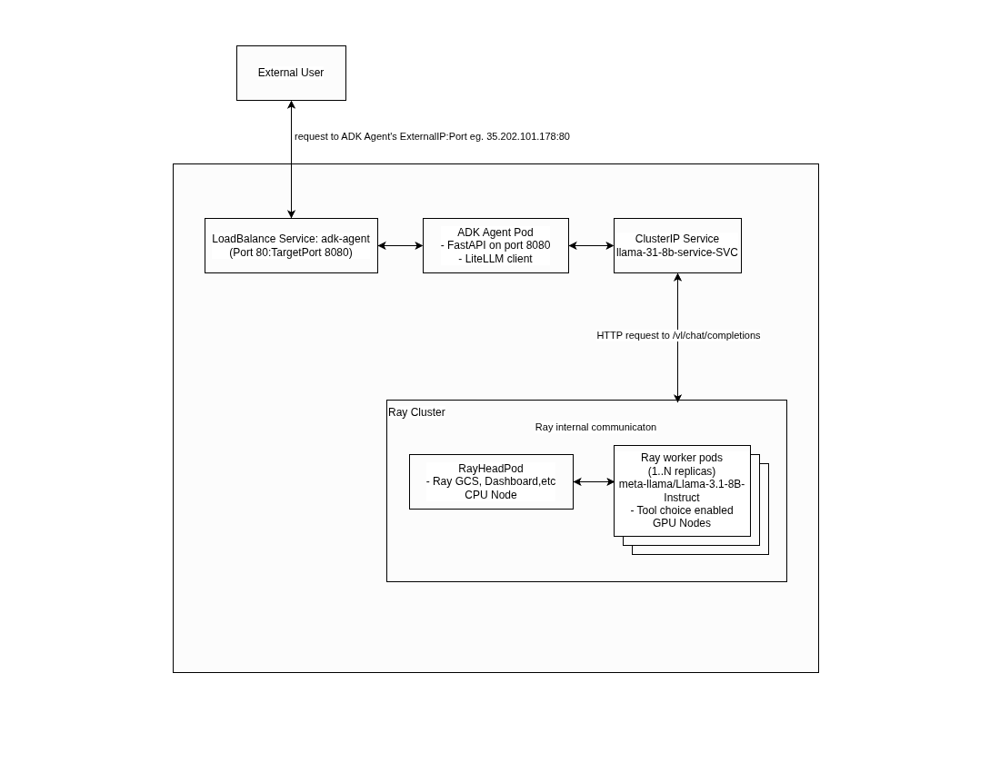
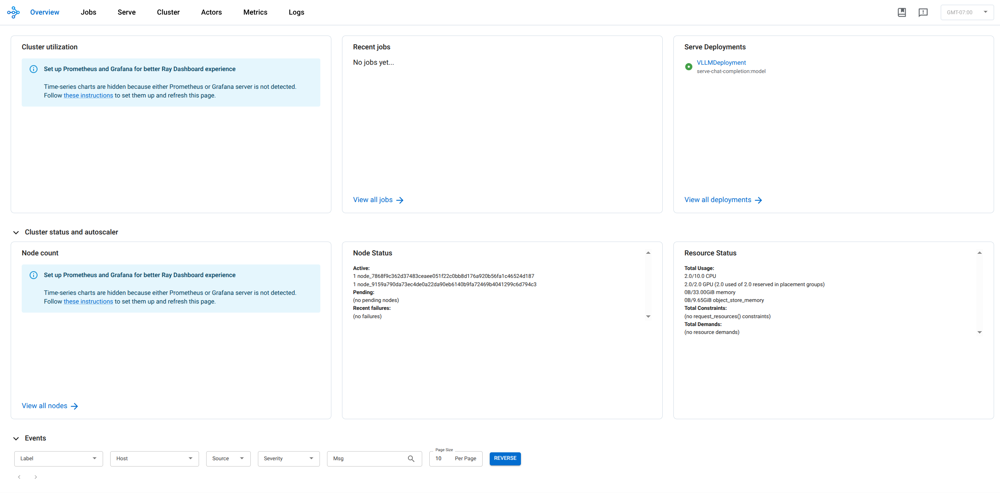

This tutorial demonstrates how to deploy the Llama-3.1-8B-Instruct model on Google Kubernetes Engine (GKE) using Ray Serve and vLLM for efficient inference. Additionally, it shows how to integrate an ADK agent to interact with the model, supporting both basic chat completions and tool usage. The setup leverages a GKE Standard cluster with GPU-enabled nodes to handle the computational requirements.

By the end of this tutorial, you will:

1. Set up a GKE Autopilot cluster with a GPU node pool.
2. Deploy the Llama-3.1-8B-Instruct model using Ray Serve and vLLM.
3. Deploy an ADK agent that communicates with the Ray Serve endpoint.
4. Test the setup with basic chat completion and tool usage scenarios.
5. Monitor and debug the deployment using Ray Dashboard and Kubernetes logs.

## Prerequisites

- A terminal with `kubectl`, `helm` and `gcloud` and `terraform 1.12.1` installed.
- A [Hugging Face](https://huggingface.co/) account with a token that has `Read` permission to access the Llama-3.1-8B-Instruct model.
- Sufficient GPU quota in your Google Cloud project. See [About GPUs](https://cloud.google.com/kubernetes-engine/docs/concepts/gpus#gpu_quota) and [Allocation quotas](https://cloud.google.com/compute/resource-usage#gpu_quota).
- Access to the code repository: https://github.com/ai-on-gke/tutorials-and-examples

### Filesystem structure

```
ray-serve/
├── adk_agent/                 # ADK agent deployment and cloudbuild configuration
| ├── example_agent/           # Agent code
|   ├── _init_.py
|   ├── agent-deployment.yaml
|   ├── agent.py
| ├── cloudbuild.yml
| ├── Dockerfile
| ├── main.py
| ├── requirements.txt
| ├── ray-serve-vllm/           # Ray image cloudbuild and service manifest
|   ├── cloudbuild.yml
|   ├── Dockerfile
|   ├── ray-service.yaml
|   ├── requirements.txt
|   ├── serve-chat-completion.py
| ├── terarform/
|   ├── artifact_registry.tf
|   ├── default_env.tfvars
|   ├── main.tf
|   ├── network.tf
|   ├── outputs.tf
|   ├── providers.tf
|   ├── variables.tf
|   └── workdload_identity.tf
```


## Step 1: Set Up the Infrastructure with Terraform

Start by setting up the GKE cluster, service account, IAM roles, and Artifact Registry using Terraform.

Download the code and navigate to the tutorial directory:

```bash
git clone https://github.com/ai-on-gke/tutorials-and-examples.git
cd tutorials-and-examples/ray-serve/terraform
```

Set the environment variables, replacing `<my-project-id>` and `<MY_HF_TOKEN>`:

```bash
gcloud config set project <my-project-id>
export PROJECT_ID=$(gcloud config get project)
export REGION=us-central1
export HF_TOKEN=<MY_HF_TOKEN>
export CLUSTER_NAME=llama-ray-cluster
```

Update the <PROJECT-ID> placeholder in `default_env.tfvars` with your own Google Cloud Project ID Name.

Initialize Terraform and apply the configuration:

```bash
terraform init
terraform apply --var-file=./default_env.tfvars
```

Review the plan and type yes to confirm. This will create:

- A GKE Autopilot cluster named llama-ray-cluster.
- A service account adk-ray-agent-sa.
- An IAM role binding granting the service account roles/artifactregistry.reader.
- An Artifact Registry repository llama-ray.

Configure `kubectl` to communicate with the cluster:

```bash
gcloud container clusters get-credentials $CLUSTER_NAME --region=$REGION --project $PROJECT_ID
```

Create a Kubernetes secret for the Hugging Face token:

```bash
kubectl create secret generic hf-secret \
  --from-literal=hf_api_token=$HF_TOKEN \
  --dry-run=client -o yaml | kubectl apply -f -
```

## Step 2: Containerize and Deploy the Ray Serve Application

Build and push the container image for the Ray Serve application to Artifact Registry.

Navigate to the ray-serve-vllm directory:

```bash
cd ../ray-serve-vllm
```

Build and push the container image:

```bash
gcloud builds submit . \
  --project=$PROJECT_ID \
  --region=$REGION
```

Deploy the Ray Serve application:

1. Open the `ray-service.yaml` file in the `ray-serve-vllm` directory.
2. Replace `<PROJECT_ID>` with your Google Cloud project name.
3. Install kuberay-operator via Helm:

    ```bash
    # Add the Helm repo
    helm repo add kuberay https://ray-project.github.io/kuberay-helm/
    helm repo update
    
    # Confirm the repo exists
    helm search repo kuberay --devel
    
    # Install both CRDs and KubeRay operator v1.3.2.
    helm install kuberay-operator kuberay/kuberay-operator --version 1.3.2
    
    # Check the KubeRay operator Pod in `default` namespace
    kubectl get pods
    # NAME                                READY   STATUS    RESTARTS   AGE
    # kuberay-operator-6fcbb94f64-mbfnr   1/1     Running   0          17s
    ```

4. Apply the manifest:
  
    ```bash
    kubectl apply -f ray-service.yaml
    ```

  Verify the deployment:
  
  - Check the Ray service status:
  
      ```bash
      kubectl get rayservice llama-31-8b -o yaml
      ```
  
  The `serviceStatus` should be `running`.
  
  - Check the raycluster:
  
    ```bash
    kubectl get raycluster
    ```
    And you should see output similar to this:
    ```bash
    NAME                           DESIRED WORKERS   AVAILABLE WORKERS   CPUS   MEMORY   GPUS   STATUS   AGE
    llama-31-8b-raycluster-qgzmk   1                 1                   10     33Gi     2      ready    58m
    ```
  
  - Check the pods:
  
    ```bash
    kubectl get pods
    ```
  
    You should see two pods: one Ray Head Pod and one Ray Worker Pod where Worker pods run the LLM and allow for scaling as the requests grow in volume and Head pod is used for management and should stay at a single replica.
  
    ```bash
    NAME                                                  READY   STATUS    RESTARTS   AGE
    kuberay-operator-bb8d4d9c4-7h2vg                      1/1     Running   0          9m33s
    llama-31-8b-raycluster-w9jzw-gpu-group-worker-9l5zx   1/1     Running   0          9m7s
    llama-31-8b-raycluster-w9jzw-head-45rx4               1/1     Running   0          9m8s
    ```
  
  - Check the config map for the chat template:
  
    ```bash
    kubectl get configmaps
    ```
    Which should display output similar to:
    ```bash
    NAME                   DATA   AGE
    kube-root-ca.crt       1      4h47m
    llama-chat-templates   1      3h18m
    ```

## Step 3: Test the Ray Serve Deployment

Test the model by setting up port forwarding and sending requests.

Set up port forwarding to the Ray Serve endpoint:

```bash
kubectl port-forward service/llama-31-8b-serve-svc 8000:8000
```

### Test: Tool Usage Capability

Send a weather query that requires tool usage:

```bash
curl http://127.0.0.1:8000/v1/chat/completions \
-X POST \
-H "Content-Type: application/json" \
-d '{
    "model": "meta-llama/Llama-3.1-8B-Instruct",
    "messages": [
        {
          "role": "user",
          "content": "What is the weather in New York today?"
        }
    ],
    "tools": [
        {
          "type": "function",
          "function": {
            "name": "get_weather",
            "description": "Get the current weather for a city",
            "parameters": {
              "type": "object",
              "properties": {
                "city": {
                  "type": "string",
                  "description": "The city name"
                }
              },
              "required": ["city"]
            }
          }
        }
    ]
}'
```

The response should include a tool call to `get_weather` with the parameter `city: "New York"`, and the `"finish_reason"` should be `"tool_calls"`. And the response should contain something like this:

```bash
{"id":"chatcmpl-5de32dca-853e-44c2-9f92-388a0ab954c7","object":"chat.completion","created":1747236975,"model":"meta-llama/Llama-3.1-8B-Instruct","choices":[{"index":0,"message":{"role":"assistant","reasoning_content":null,"content":null,"tool_calls":[{"id":"chatcmpl-tool-8dd7be12aefe48db82c95485622202cb","type":"function","function":{"name":"get_weather","arguments":"{\"city\": \"New York\"}"}}]},"logprobs":null,"finish_reason":"tool_calls","stop_reason":128008}],"usage":{"prompt_tokens":254,"total_tokens":273,"completion_tokens":19,"prompt_tokens_details":null},"prompt_logprobs":null}
```

## Step 4: Deploy the ADK Agent

Navigate to the ADK agent directory:

```bash
cd ../adk_agent
```

Build and push the ADK agent container image:

```bash
gcloud builds submit . \
  --project=${PROJECT_ID} \
  --region=$REGION
```

Update the `./example-agent/agent-deployment.yaml` file <PROJECT-ID> and <REGION> placeholders where applicable. Apply the manifest:

```bash
kubectl apply -f ./example-agent/agent-deployment.yaml
```

Verify the deployment:

- Check the pods:

  ```bash
  kubectl get pods
  ```

  You should see three pods: the two Ray pods and the ADK agent pod.
  ```bash
  NAME                                                  READY   STATUS    RESTARTS   AGE
  adk-agent-6ddffd9b5b-m2txm                            1/1     Running   0          2m56s
  kuberay-operator-bb8d4d9c4-7h2vg                      1/1     Running   0          14m
  llama-31-8b-raycluster-w9jzw-gpu-group-worker-9l5zx   1/1     Running   0          14m
  llama-31-8b-raycluster-w9jzw-head-45rx4               1/1     Running   0          14m
  ```
- Check the services:

  ```bash
  kubectl get services
  ```

  You should see six services, including the ADK agent LoadBalancer service.

  ```bash
  NAME                                    TYPE           CLUSTER-IP       EXTERNAL-IP     PORT(S)                                         AGE
  adk-agent                               LoadBalancer   34.118.231.166   34.72.141.248   80:30319/TCP                                    2m4s
  kuberay-operator                        ClusterIP      34.118.227.98    <none>          8080/TCP                                        14m
  kubernetes                              ClusterIP      34.118.224.1     <none>          443/TCP                                         4h53m
  llama-31-8b-head-svc                    ClusterIP      None             <none>          10001/TCP,8265/TCP,6379/TCP,8080/TCP,8000/TCP   95s
  llama-31-8b-raycluster-w9jzw-head-svc   ClusterIP      None             <none>          10001/TCP,8265/TCP,6379/TCP,8080/TCP,8000/TCP   13m
  llama-31-8b-serve-svc                   ClusterIP      34.118.226.99    <none>          8000/TCP                                        95s
  ```

Get the external IP of the ADK agent LoadBalancer:

```bash
kubectl get service adk-agent -o jsonpath='{.status.loadBalancer.ingress[0].ip}'
```

## Step 5: Test the ADK Agent

Send requests directly to the ADK agent LoadBalancer external IP.

### Test: Example ADK Agent

The ADK agent framework uses sessions to manage state and context. The /run endpoint expects a session_id in the request payload.

- Create a session for test user:

  ```bash
  curl http://$EXTERNAL_IP:80/apps/example-agent/users/user1/sessions \
    -X POST \
    -H "Content-Type: application/json" \
    -d '{}'
  ```

  The response is expected to be something like this:
  
    ```bash
    {"id":"836c4e74-5ee3-4bc8-96c2-94d77f079e34","app_name":"example-agent","user_id":"user1","state":{},"events":[],"last_update_time":1747352210.0}
    ```

- Copy the session id and send the example request:

  ```bash
  curl http://$EXTERNAL_IP:80/run \
    -X POST \
    -H "Content-Type: application/json" \
    -d '{
      "app_name": "example-agent",
      "user_id": "user1",
      "session_id": "836c4e74-5ee3-4bc8-96c2-94d77f079e34",
      "new_message": {
        "parts": [{"text": "What is the weather like in Seattle?"}],
        "role": "user"
      }
    }'
  ```

  The response should be similar to the Ray Serve test. Example:

  ```bash
  [{"content":{"parts":[{"functionCall":{"id":"chatcmpl-tool-63bff6965a04437eb9e16aa8e8e4786b","args":{"city":"Seattle"},"name":"get_current_weather"}}],"role":"model"},"partial":false,"invocation_id":"e-18006854-6c17-4d27-8a8f-342bd252106a","author":"weather_agent","actions":{"state_delta":{},"artifact_delta":{},"requested_auth_configs":{}},"long_running_tool_ids":[],"id":"YOqORD5M","timestamp":1747352916.229682},{"content":{"parts":[{"functionResponse":{"id":"chatcmpl-tool-63bff6965a04437eb9e16aa8e8e4786b","name":"get_current_weather","response":{"result":"The weather in Seattle is currently 12°C with rainy conditions."}}}],"role":"user"},"invocation_id":"e-18006854-6c17-4d27-8a8f-342bd252106a","author":"weather_agent","actions":{"state_delta":{},"artifact_delta":{},"requested_auth_configs":{}},"id":"x9zqpTMd","timestamp":1747352917.060611},{"content":{"parts":[{"text":"The function call returns the current weather in Seattle."}],"role":"model"},"partial":false,"invocation_id":"e-18006854-6c17-4d27-8a8f-342bd252106a","author":"weather_agent","actions":{"state_delta":{},"artifact_delta":{},"requested_auth_configs":{}},"id":"CbXReduJ","timestamp":1747352917.067558}]
  ```
  
  Here is how the request path looks like:
  
  

## Step 6: Monitor and Debug

Use the Ray Dashboard for observability:

```bash
kubectl port-forward <raycluster-head-pod> 8265:8265
```

Access the dashboard at `http://127.0.0.1:8265` to view logs, metrics and debug Ray applications. This will allow you to see a visual representation on how your Ray cluster is performing.



## GPU Resource Utilization

The deployment uses one VLLM instance (`num_replicas: 1`) with tensor parallelism (`TENSOR_PARALLELISM: 2`), requiring 2 GPUs. The GKE cluster provides 2 GPUs via one `g2-standard-24` node in the node pool (`workerGroupSpecs.replicas: 1`). This ensures efficient resource utilization for the Ray Worker Pod.

## Clean Up

To avoid incurring charges, delete the GKE cluster and associated resources:

```bash
cd ../terraform
terraform destroy --var-file=./default_env.tfvars
```

Verify the destruction plan and type "yes" to confirm.
