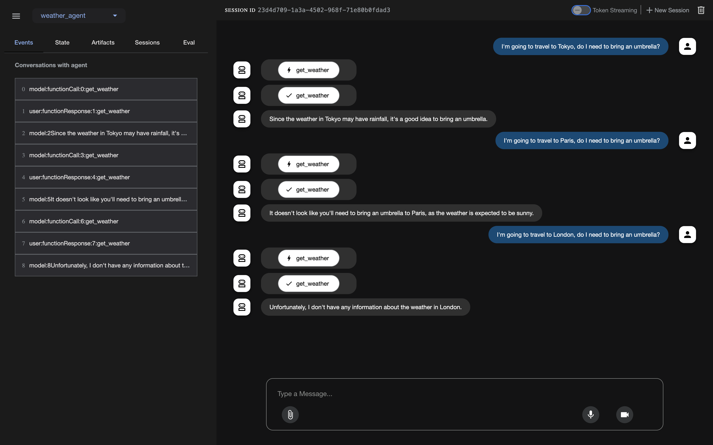

# Building Agents with Agent Development Kit (ADK) on GKE using Self-Hosted LLM

# Overview

In this tutorial we are going to create an agent that will receive user queries about weather conditions in various locations, parse the location and temperature unit (C/F) from the prompt and answer accordingly.
The agent will use the following tool:

- `get_weather`: to retrieve weather information, format, and present weather data with appropriate temperature symbols, handle edge cases for unknown locations and invalid queries

The project structure:

```
tutorials-and-examples/adk/llama/vllm/
├── deploy-agent/
│   ├── Dockerfile
│   ├── deploy-agent.yaml
│   ├── main.py
│   ├── requirements.txt
│   └── weather_agent/
│       ├── __init__.py
│       └── agent.py
│
├── deploy-llm/
│   └── deploy-llm.yaml
│
├── terraform/
│   ├── backend.tf
│   ├── example_vars.tfvars
│   ├── main.tf
│   ├── outputs.tf
│   ├── variables.tf
│   └── versions.tf
```

# Before you begin

Make sure you have installed:

* terraform
* gcloud CLI
* git
* kubectl

Make sure you have enabled the following APIs:

* [GKE](https://console.cloud.google.com/marketplace/product/google/container.googleapis.com?inv=1&invt=Abma5w&project=cvdjango&returnUrl=/kubernetes/overview/get-started?inv%3D1%26invt%3DAbma5w%26project%3Dcvdjango)
* [Artifact Registry API](https://console.cloud.google.com/marketplace/product/google/artifactregistry.googleapis.com?returnUrl=/artifacts?invt%3DAbma5w%26inv%3D1%26project%3Dcvdjango&project=cvdjango&inv=1&invt=Abma5w&flow=gcp)

# Create a GKE cluster

First of all, you need to clone the tutorials repository and go to the specific directory. Run these commands below:
```bash
git clone https://github.com/ai-on-gke/tutorials-and-examples.git
cd ./tutorials-and-examples/adk/llama/vllm
```

To create a GKE cluster for this tutorial, you should go to the `terraform` folder, copy `example_vars.tfvars` file as `vars.tfvars`. Replace the following variables with your actual values:

* `<PROJECT_ID>`: with your Google project ID
* `<CLUSTER_NAME>`: with any name you would like to
* `<KUBERNETES_NAMESPACE>`: with any name you would like to

Run the following commands to create your GKE cluster:

```bash
terraform init
terraform apply -var-file=vars.tfvars
```

Run the following command to get an access to your cluster:

```bash
export CLUSTER_NAME=<CLUSTER_NAME>
gcloud container clusters get-credentials ${CLUSTER_NAME} --location=us-central1
```

# Deploy an LLM to a GKE Autopilot cluster

In this section we will use vLLM for the deployment and [meta-llama/Llama-3.1-8B-Instruct](https://huggingface.co/meta-llama/Llama-3.1-8B-Instruct) (you have to visit their site and request an access) as a core LLM. So far, you are currently in the `terraform` folder. Go to the `deploy-llm` folder. In this folder you can see the following:

* `templates` folder: it stores all templates for LLMs. Currently it has only one template for Llama-3.1-8B-Instruct. The templates are necessary to use tools, because it formats the LLM’s output.
* `deploy-llm.yaml`: this manifest creates a deployment with vLLM that serves Llama-3.1-8B-Instruct and a service that allows us to access this model via http protocol.

To successfully deploy our model, we need to create a Huggingface secret inside the GKE cluster and a configmap that contains all templates.
Run these commands to create the Huggingface secret:

```bash
export HF_TOKEN=<YOUR_HF_TOKEN>
kubectl create secret generic hf-token-secret-artur \
    --from-literal=token=${HF_TOKEN} \
    --dry-run=client -o yaml | kubectl apply -f -
```

Now we can create our deployment and service with our LLM by running this command:

```bash
kubectl apply -f deploy-llm.yaml
```

> Note that in this manifest we also create a configmap with a chat template for our LLM.

You can check the status of the deployment by running `logs -f` command on the pod.
Once your logs look like this:

```bash
INFO 05-08 12:41:31 [launcher.py:36] Route: /v1/rerank, Methods: POST
INFO 05-08 12:41:31 [launcher.py:36] Route: /v2/rerank, Methods: POST
INFO 05-08 12:41:31 [launcher.py:36] Route: /invocations, Methods: POST
INFO 05-08 12:41:31 [launcher.py:36] Route: /metrics, Methods: GET
INFO:     Started server process [1]
INFO:     Waiting for application startup.
INFO:     Application startup complete.
```

## Testing

You can port-forward the service by running this command:

```bash
kubectl port-forward svc/vllm-llama3-service 8000:8000
```

And invoke your model by running this command:

```bash
curl http://127.0.0.1:8000/v1/chat/completions \
-X POST \
-H "Content-Type: application/json" \
-d '{
    "model": "meta-llama/Llama-3.1-8B-Instruct",
    "messages": [
        {
          "role": "user",
          "content": "Why is the sky blue?"
        }
    ]
}' | jq
```

The output should look like this:

```log
{
  "id": "chatcmpl-850e02518e4145de94926b60c1ccab8c",
  "object": "chat.completion",
  "created": 1747225977,
  "model": "meta-llama/Llama-3.1-8B-Instruct",
  "choices": [
    {
      "index": 0,
      "message": {
        "role": "assistant",
        "reasoning_content": null,
        "content": "The sky appears blue due to a phenomenon called Rayleigh scattering, which is the scattering of light by small particles or molecules in the atmosphere. Here's a simplified explanation:\n\n1. **Sunlight enters the Earth's atmosphere**: When sunlight enters the Earth's atmosphere, it consists of a spectrum of colors, including red, orange, yellow, green, blue, and violet.\n2. **Light interacts with tiny molecules**: The tiny molecules of gases such as nitrogen (N2) and oxygen (O2) in the atmosphere scatter the light in all directions.\n3. **Blue light is scattered more**: The shorter (blue) wavelengths of light are scattered more than the longer (red) wavelengths. This is because the smaller molecules are more effective at scattering the shorter wavelengths.\n4. **Our eyes see the scattered light**: As the scattered light reaches our eyes, we see the blue color. This is because our eyes are more sensitive to blue light than to other colors.\n5. **Red light reaches our eyes directly**: The longer wavelengths of light (red and orange) are able to travel longer distances without being scattered, so they reach our eyes directly, giving the sky a hint of red or orange during sunrise and sunset.\n\nSo, the blue color of the sky is a result of the scattering of sunlight by the tiny molecules in the atmosphere, which favors the shorter wavelengths of light, such as blue.\n\nIt's worth noting that the color of the sky can change depending on various factors, such as:\n\n* **Time of day**: During sunrise and sunset, the sky can take on hues of red, orange, and pink due to the scattering of light by atmospheric particles.\n* **Atmospheric conditions**: Dust, pollution, and water vapor in the atmosphere can affect the color of the sky.\n* **Altitude**: The color of the sky can change at higher altitudes due to the thinner atmosphere.\n\nI hope this explanation helps you understand why the sky is blue!",
        "tool_calls": []
      },
      "logprobs": null,
      "finish_reason": "stop",
      "stop_reason": null
    }
  ],
  "usage": {
    "prompt_tokens": 41,
    "total_tokens": 438,
    "completion_tokens": 397,
    "prompt_tokens_details": null
  },
  "prompt_logprobs": null
}
```

# Create an ADK application

You are currently in the `deploy-llm` folder. Go to the `deploy-agent` folder. Here you can see the following content:

* `weather_agent` folder: contains `__init__.py` and `agent.py` files. They define our agent functionality.
* `deploy_agent.yaml`: creates a deployment and a service for our agent application.
* `Dockerfile`: for the application build.
* `main.py`: defines web applications to interact with.
* `requirements.txt`: contains all dependencies.

In the `weather_agent/agent.py` script you can see our `get_weather` function that returns dummy values about 3 cities and an error message for other cities. Also you can see here how we connect to the deployed model using `LiteLlm`.

To be able to deploy our agent application, we need to create a repository in Artifact Registry, grant read access to the default GKE cluster account, and submit our application to the repository.

Run this command create a repository:

```bash
export PROJECT_ID=<your_project_id>
export GOOGLE_CLOUD_LOCATION=us-central1
gcloud artifacts repositories create adk-repo \
    --repository-format=docker \
    --location=$GOOGLE_CLOUD_LOCATION \
    --description="ADK repository"
```

Run this command to submit our application to the repository:

```bash
gcloud builds submit \
    --tag $GOOGLE_CLOUD_LOCATION-docker.pkg.dev/$PROJECT_ID/adk-repo-dima/adk-agent:latest \
    --project=$PROJECT_ID \
    .
```

Then grant read only permission to the default GKE cluster account by running these command:
To get the email run this command:

```bash
gcloud container clusters describe $CLUSTER_NAME \
  --region $REGION \
  --format="value(nodeConfig.serviceAccount)"
```

Then replace \<DEFAULT\_EMAIL\> with actual email.

```bash
gcloud artifacts repositories add-iam-policy-binding adk-repo \
    --project="${PROJECT_ID}" \
    --location="${GOOGLE_CLOUD_LOCATION}" \
    --member="serviceAccount:<DEFAULT_EMAIL>" \
    --role="roles/artifactregistry.reader"
```

Now you can replace `<PROJECT_ID>` in the `deploy-agent.yaml` and run this command:

```bash
kubectl apply -f deploy-agent.yaml
```

You can review the status by running logs \-f command on the associated pod. The output logs should look like this:

```log
INFO:     Started server process [6]
INFO:     Waiting for application startup.
INFO:     Application startup complete.
INFO:     Uvicorn running on http://0.0.0.0:8080 (Press CTRL+C to quit)
```

## Testing

To test your application, you can port-forward the agent service like this:

```bash
kubectl port-forward svc/adk-agent 8001:80
```

And go to the [http://127.0.0.1:8001](http://127.0.0.1:8001). Try to ask about the weather in some city and check what will happen. It should look like this:


Note, that our tool has dummy data:

```log
city_weather = {
        "paris": "The weather in Paris is sunny with a temperature of 25 degrees Celsius (77 degrees Fahrenheit).",
        "ottawa": "In Ottawa, it's currently cloudy with a temperature of 18 degrees Celsius (64 degrees Fahrenheit) and a chance of rain.",
        "tokyo": "Tokyo is experiencing humid conditions with a temperature of 28 degrees Celsius (82 degrees Fahrenheit) and possible rainfall."
    }
```

So our agent should not provide information about other cities.

# Clean up

Remove the read-only access to the Artifact Registry repository by running this command:

```bash
gcloud artifacts repositories remove-iam-policy-binding adk-repo \
    --project="${PROJECT_ID}" \
    --location="${GOOGLE_CLOUD_LOCATION}" \
    --member="serviceAccount:<DEFAULT_EMAIL>" \
    --role="roles/artifactregistry.reader"
```

Delete the Artifact Registry repository by running this command:

```bash
gcloud artifacts repositories delete adk-repo --location=${GOOGLE_CLOUD_LOCATION}
```

Go back to the `terraform` folder and run this command to delete the infrastructure:

```bash
terraform destroy -var-file=vars.tfvars
```
