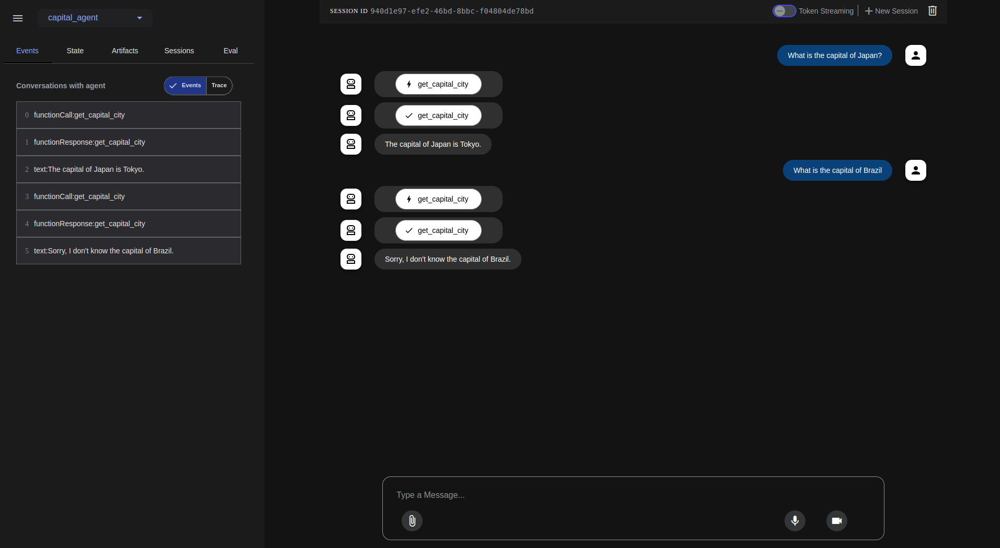

## Deploying Google Agent Development Kit (ADK) Agents on Google Kubernetes Engine (GKE)

This tutorial guides you through deploying a containerized agent built with the [Google Agent Development Kit (ADK)](https://google.github.io/adk-docs/) to [Google Kubernetes Engine (GKE)](https://cloud.google.com/kubernetes-engine/docs/concepts/kubernetes-engine-overview). GKE provides a managed environment for deploying, managing, and scaling your containerized applications using Google infrastructure.  

## Overview

In this tutorial we will deploy a simple agent to GKE. The agent will be a FastAPI application that uses Gemini 2.0 Flash as the LLM. We will use Vertex AI as the LLM provider.

This tutorial will cover:

* Setting up your Google Cloud environment.  
* Building a container image for your agent.  
* Deploying the agent to a GKE cluster.  
* Testing your deployed agent.

## Before you begin

Ensure you have the following tools installed on your workstation  
   * [gcloud CLI](https://cloud.google.com/sdk/docs/install)  
   * [kubectl](https://kubernetes.io/docs/tasks/tools/#kubectl)  
   * [terraform](https://developer.hashicorp.com/terraform/tutorials/aws-get-started/install-cli)

If you previously installed the gcloud CLI, get the latest version by running:

```
gcloud components update
```

Ensure that you are signed in using the gcloud CLI tool. Run the following command:

```
gcloud auth application-default login
```

## Infrastructure Setup

### Clone the repository

Clone the repository with our guides and cd to the `adk/vertex/` directory by running these commands:

```
git clone https://github.com/ai-on-gke/tutorials-and-examples.git
cd tutorials-and-examples/adk/vertex
```

### Filesystem structure

```
adk/vertex/
├── terraform/    # Terraform configuration for automated deployment of an infrastructure
└── app/          # Empty directory that we will create to put files created during the tutorial
```

### Enable Necessary APIs

Enable the APIs required for GKE, Artifact Registry, Cloud Build, and Vertex AI

```
gcloud services enable \
    container.googleapis.com \
    artifactregistry.googleapis.com \
    cloudbuild.googleapis.com \
    aiplatform.googleapis.com
```

## Create cluster and other resources

In this section we will use Terraform to automate the creation of infrastructure resources. For more details how it is done please refer to the terraform config in the `terraform/` folder. By default, the configuration provisions an Autopilot GKE cluster, but it can be changed to standard by setting `autopilot_cluster = false`.

It creates:

* Cluster IAM Service Account – manages permissions for the GKE cluster.  
* Application’s IAM Service Account – manages permissions for the deployed application to access:
    - [VertexAI](https://cloud.google.com/vertex-ai/docs) LLM model.
    - [CloudSQL](https://cloud.google.com/sql/docs/introduction) instance with PostgreSQL database.
* [CloudSQL](https://cloud.google.com/sql/docs/introduction) instance to store data.  
* [Artifact registry](https://cloud.google.com/artifact-registry/docs/overview) – stores container images for the application.  
    
1. Go the the terraform directory:

```
cd terraform
```

   

2. Specify the following values inside the `default_env.tfvars` file (or make a separate copy):  
   * `<PROJECT_ID>` – replace with your project id (you can find it in the project settings).

Other values can be changed, if needed, but can be left with default values.

3. Init terraform modules:

```
terraform init
```

   

4. Optionally run the plan command to view an execution plan:

```
terraform plan -var-file=default_env.tfvars
```

   

5. Execute the plan:

```
terraform apply -var-file=default_env.tfvars
```

And you should see your resources created:

```
Apply complete! Resources: 27 added, 0 changed, 0 destroyed.

Outputs:

cloudsql_instance_fqdn = "<PROJECT ID>:us-central1:adk-tf"
gke_cluster_location = "us-central1"
gke_cluster_name = "adk-tf"
image_repository_full_name = "us-docker.pkg.dev/<PROJECT ID>/adk-tf"
image_repository_location = "us"
image_repository_name = "adk-tf"
k8s_service_account_name = "adk-tf"
project_id = <PROJECT ID>

```

6. Configure your kubectl context:

```
gcloud container clusters get-credentials $(terraform output -raw gke_cluster_name) --region $(terraform output -raw gke_cluster_location)
```

## Deploy and Configure the Agent Application

The desired structure of the final application should be:

```
app/
├── capital_agent/             # Agent's module name
│   ├── __init__.py
│   └── agent.py               # Your agent logic
├── main.py                    # FastAPI application entry point
├── requirements.txt           # Python dependencies
└── Dockerfile                 # Container build instructions
```

1. Create the `app` directory:

```
mkdir ../app
```

2. Create the `app/main.py` file. This file sets up the FastAPI application using `get_fast_api_app()` from ADK.  
   

```py
import os
import sys

import uvicorn
from fastapi import FastAPI
from google.adk.cli.fast_api import get_fast_api_app

# Get the directory where main.py is located
AGENT_DIR = os.path.dirname(os.path.abspath(__file__))

def _get_env_or_fail(name: str):
    value = os.environ.get(name)
    if value is None:
        print(f"Environment variable '{name}' must be set", file=sys.stderr)
        exit(1)
    return value

DB_HOST=os.environ.get("DB_HOST", "localhost")
DB_PORT=os.environ.get("DB_PORT", "5432")
DB_USER=_get_env_or_fail("DB_USER")
DB_PSWD=_get_env_or_fail("DB_PSWD")
DB_NAME=_get_env_or_fail("DB_NAME")

# Create connection string for the database
SESSION_DB_URL = f"postgresql://{DB_USER}:{DB_PSWD}@{DB_HOST}:{DB_PORT}/{DB_NAME}"
# Example allowed origins for CORS
ALLOWED_ORIGINS = ["http://localhost", "http://localhost:8080", "*"]
# Set web=True if you intend to serve a web interface, False otherwise
SERVE_WEB_INTERFACE = True

# Call the function to get the FastAPI app instance
# Ensure the agent directory name ('capital_agent') matches your agent folder
app: FastAPI = get_fast_api_app(
    agent_dir=AGENT_DIR,
    session_db_url=SESSION_DB_URL,
    allow_origins=ALLOWED_ORIGINS,
    web=SERVE_WEB_INTERFACE,
)

# You can add more FastAPI routes or configurations below if needed
# Example:
# @app.get("/hello")
# async def read_root():
#     return {"Hello": "World"}

if __name__ == "__main__":
    # Use the PORT environment variable provided by Cloud Run, defaulting to 8080
    uvicorn.run(app, host="0.0.0.0", port=int(os.environ.get("PORT", 8080)))
```

3. Create agent files. When finished, your agent code has to meet these requirements:
    * Agent code is in a file called `agent.py` within your agent directory.  
    * Your agent variable is named `root_agent`.  
    * `__init__.py` is within your agent directory and contains `from . import agent`.  

4. Create the `app/capital_agent/agent.py` file:

```
from google.adk.agents import LlmAgent

# Define a tool function
def get_capital_city(country: str) -> str:
  """Retrieves the capital city for a given country."""
  # Replace with actual logic (e.g., API call, database lookup)
  capitals = {"france": "Paris", "japan": "Tokyo", "canada": "Ottawa"}
  return capitals.get(country.lower(), f"Sorry, I don't know the capital of {country}.")


capital_agent = LlmAgent(
    model="gemini-2.0-flash",
    name="capital_agent",
    description="Answers user questions about the capital city of a given country.",
    instruction="""You are an agent that provides the capital city of a country... (previous instruction text)""",
    tools=[get_capital_city] # Provide the function directly
)

root_agent = capital_agent
```

5. Crete `app/capital_agent/__init__.py` file:

```
from . import agent
```

6. Create `app/requirements.txt` file with necessary Python packages:

```
google_adk>=0.1.0
fastapi>=0.95.0
uvicorn>=0.22.0
pydantic>=2.0.0
litellm>=0.1.0
sqlalchemy[postgresql]>=2.0
```

7. Create `app/Dockerfile` to build app container image:

```
# Use an official Python runtime as a parent image
FROM python:3.10-slim

# Set the working directory in the container
WORKDIR /app

# Install build dependencies
RUN apt-get update && apt-get install -y libpq-dev build-essential \ 
  && apt-get clean \
  && rm -rf /var/lib/apt/lists/*

# Copy the requirements file into the container at /app
COPY requirements.txt .

# Install any needed packages specified in requirements.txt
RUN pip install --no-cache-dir -r requirements.txt

# Copy the current directory contents into the container at /app
COPY . .

# Make port 8080 available to the world outside this container
EXPOSE 8080

# Define environment variables if needed (e.g., for Vertex AI project and location)
# These can also be set in the Kubernetes manifest
# ENV GOOGLE_CLOUD_PROJECT="your-gcp-project"
# ENV GOOGLE_CLOUD_LOCATION="your-gcp-region"
# ENV ADK_LLM_PROVIDER="VERTEX_AI" # or "AI_STUDIO"
# ENV VERTEX_AI_MODEL_NAME="gemini-1.0-pro" # or other model

# Run main.py when the container launches
CMD ["uvicorn", "main:app", "--host", "0.0.0.0", "--port", "8080"]
```

8. Build and Push the Container Image

Build your Docker image using Google Cloud Build and push it to the Artifact Registry repository that is created by the Terraform:

```
gcloud builds submit \
    --tag $(terraform output -raw image_repository_full_name)/adk-agent:latest \
    --project=$(terraform output -raw project_id) \
    ../app
```

9. Run this command to create `app/deplyment.yaml` file with Kubernetes Manifest. This command has to create manifest with values taken from the terraform:  

```
cat <<  EOF > ../app/deployment.yaml
apiVersion: apps/v1
kind: Deployment
metadata:
  name: adk-agent
spec:
  replicas: 1
  selector:
    matchLabels:
      app: adk-agent
  template:
    metadata:
      labels:
        app: adk-agent
    spec:
      serviceAccount: $(terraform output -raw k8s_service_account_name)
      containers:
      - name: adk-agent
        imagePullPolicy: Always
        image: $(terraform output -raw image_repository_full_name)/adk-agent:latest
        resources:
          limits:
            memory: "256Mi"
            cpu: "500m"
            ephemeral-storage: "128Mi"
          requests:
            memory: "256Mi"
            cpu: "500m"
            ephemeral-storage: "128Mi"
        ports:
        - containerPort: 8080
        env:
          - name: PORT
            value: "8080"
          - name: GOOGLE_CLOUD_PROJECT
            value: $(terraform output -raw project_id)
          - name: GOOGLE_CLOUD_LOCATION
            value: $(terraform output -raw gke_cluster_location)
          - name: GOOGLE_GENAI_USE_VERTEXAI
            value: "true"
          - name: DB_HOST
            value: localhost
          - name: DB_PORT
            value: "5432"
          - name: DB_USER
            valueFrom:
              secretKeyRef:
                name: db-secret
                key: username
          - name: DB_PSWD
            valueFrom:
              secretKeyRef:
                name: db-secret
                key: password
          - name: DB_NAME
            valueFrom:
              secretKeyRef:
                name: db-secret
                key: database
        readinessProbe:
          httpGet:
            path: /
            port: 8080
          initialDelaySeconds: 10
          periodSeconds: 10
          timeoutSeconds: 5
          failureThreshold: 5
          successThreshold: 1
      # A sidecar container to connect to CloudSQL postgresql database
      - name: cloud-sql-proxy
        image: gcr.io/cloud-sql-connectors/cloud-sql-proxy:2.14.1
        args:
          - "--private-ip"
          - "--structured-logs"
          - "--port=5432"
          - "$(terraform output -raw cloudsql_instance_fqdn)"
        securityContext:
          runAsNonRoot: true
        resources:
          limits:
            cpu: "1"
            memory: "2Gi"
          requests:
            cpu: "1"
            memory: "2Gi"
---
apiVersion: v1
kind: Service
metadata:
  name: adk-agent
spec:       
  type: ClusterIP
  ports:
    - port: 80
      targetPort: 8080
  selector:
    app: adk-agent
EOF
```

10. Apply the manifest:

```
kubectl apply -f ../app/deployment.yaml
```

11. Wait for deployment to be completed. It may take some time:

```
kubectl rollout status deployment/adk-agent
```

## Testing your Deployed Agent

1. Forward port of the deployed application service:

```
kubectl port-forward svc/adk-agent 8080:80
```

2. Go to the [http://localhost:8080/](http://localhost:8080/) and test the web UI. You can test your agent by simply navigating to the kubernetes service URL in your web browser.

The ADK dev UI allows you to interact with your agent, manage sessions, and view execution details directly in the browser.

To verify your agent is working as intended, you can:

1. Select your agent from the dropdown menu.  
2. Type a message and verify that you receive an expected response from your agent.



If you experience any unexpected behavior, check the pod logs for your agent using:

```
kubectl logs -l app=adk-agent
```

## Troubleshooting

These are some common issues you might encounter when deploying your agent to GKE:

### 403 Permission Denied for Gemini 2.0 Flash

This usually means that the Kubernetes service account does not have the necessary permission to access the Vertex AI API. Ensure that you have created the service account and bound it to the Vertex AI User role as described in the Configure Kubernetes Service Account for Vertex AI section. If you are using AI Studio, ensure that you have set the GOOGLE\_API\_KEY environment variable in the deployment manifest and it is valid.

### Attempt to write a readonly database

You might see there is no session id created in the UI and the agent does not respond to any messages. This is usually caused by the SQLite database being read-only. This can happen if you run the agent locally and then create the container image which copies the SQLite database into the container. The database is then read-only in the container.

```
sqlalchemy.exc.OperationalError: (sqlite3.OperationalError) attempt to write a readonly database
[SQL: UPDATE app_states SET state=?, update_time=CURRENT_TIMESTAMP WHERE app_states.app_name = ?]

```

To fix this issue, you can either:

Delete the SQLite database file from your local machine before building the container image. This will create a new SQLite database when the container is started.

```
rm -f sessions.db
```

or (recommended) you can add a .dockerignore file to your project directory to exclude the SQLite database from being copied into the container image.

Build the container image and deploy the application again.

## Cleaning up

1. Destroy the provisioned infrastructure.

```
terraform destroy -var-file=default_env.tfvars
```
