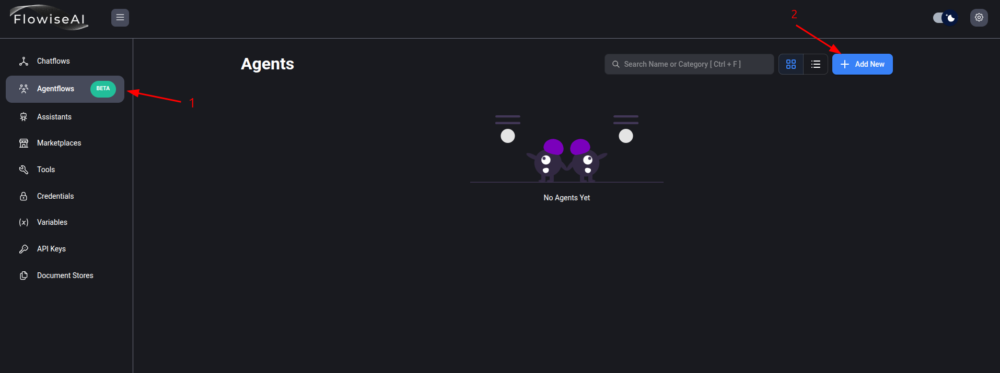
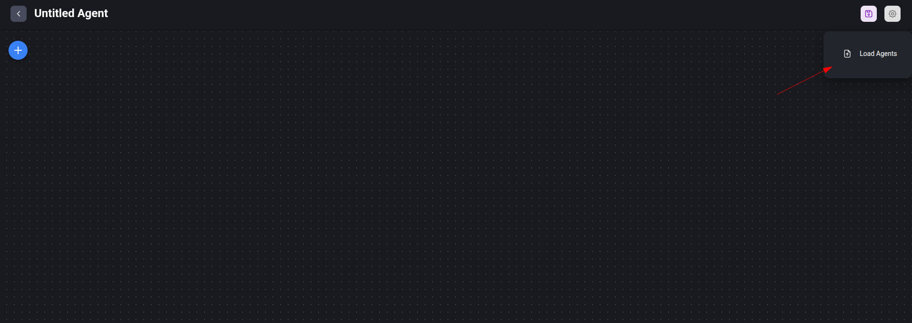
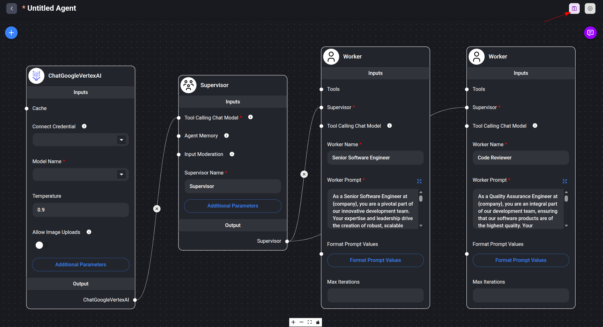
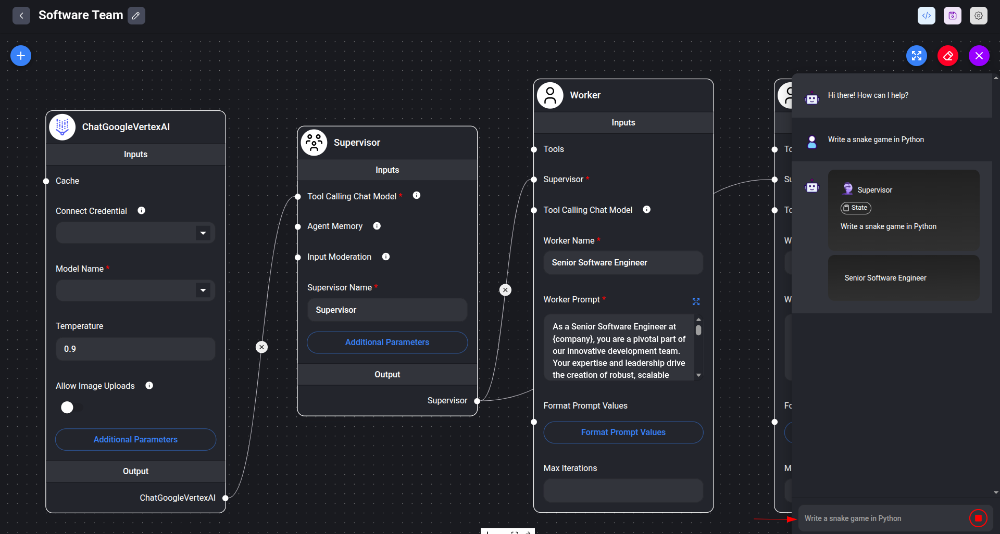

This tutorial will provide instructions on how to deploy and use [FlowiseAI](https://flowiseai.com/) on GKE (Google Kubernetes Engine) to build and operate AI applications using a low-code/no-code approach.

## Overview

This tutorial is designed for developers and platform engineers interested in leveraging FlowiseAI on GKE for building customized LLM flows and AI agents, offloading resource-intensive tasks to a managed cluster. As an example for this tutorial, we will create a multi-agent application that acts as a software development team with a software developer and a code reviewer which are coordinated by a supervisor. For more info, you may want to read the [docs](https://docs.flowiseai.com/using-flowise/agentflowv1/multi-agents).

### What will you learn

1. Provision required infrastructure automatically (using Terraform). The GKE Autopilot cluster is used by default.  
2. Install FlowiseAI on the GKE cluster.  
3. Configure FlowiseAI to build and manage LLM flows.  
4. Build a sample AI application (e.g., a chatbot or agent) using FlowiseAI components.  
5. Serve the resulting AI application from the GKE cluster.

### Filesystem structure

```
├── agentflow.json  # Example Flowise Agentflow.
├───── cloudsql.tf
├───── default_env.tfvars
├───── main.tf
├───── network.tf
├───── outputs.tf
├───── variables.tf
├───── workload_idenity.tf
└── terraform/      # Terraform config that creates required infrastructure.
```

## Before you begin

1. Ensure you have a GCP project with billing enabled and [enabled the GKE API](https://cloud.google.com/kubernetes-engine/docs/how-to/enable-gkee).  
2. Ensure you have the following tools installed on your workstation  
   * [gcloud CLI](https://cloud.google.com/sdk/docs/install)  
   * [kubectl](https://kubernetes.io/docs/tasks/tools/#kubectl)  
   * [terraform](https://developer.hashicorp.com/terraform/tutorials/aws-get-started/install-cli)  
   * [helm](https://helm.sh/docs/intro/install/)  
     

If you previously installed the gcloud CLI, get the latest version by running:

```bash
gcloud components update
```

Ensure that you are signed in using the gcloud CLI tool. Run the following command:

```bash
gcloud auth application-default login
```

## Infrastructure Setup

### Clone the repository

Clone the repository with our guides and cd to the `flowise/` directory by running these commands:

```bash
git clone https://github.com/ai-on-gke/tutorials-and-examples.git
cd tutorials-and-examples/flowise
```

### Enable Necessary APIs

Enable the APIs required for GKE, Artifact Registry, Cloud Build, and Vertex AI

```bash
gcloud services enable \
    container.googleapis.com \
    aiplatform.googleapis.com
```

### Create cluster and other resources

In this section we will use Terraform to automate the creation of infrastructure resources. For more details how it is done please refer to the terraform config in the `terraform/` folder. By default, the configuration provisions an Autopilot GKE cluster, but it can be changed to standard by setting `autopilot_cluster = false`.

It creates the following resources. For more information such as resource names and other details, please refer to the [Terraform config](https://github.com/ai-on-gke/tutorials-and-examples/tree/main/flowise/terraform):

* Service Accounts:  
  1. Cluster IAM Service Account (derives name from a cluster name, e.g. `tf-gke-<cluster name>`) – manages permissions for the GKE cluster.  
  2. Application’s IAM Service Account (default name `flowise-tf` and can be changed in the terraform config) – manages permissions for the deployed application to access:  
     * [VertexAI](https://cloud.google.com/vertex-ai/docs) LLM model.  
     * [CloudSQL](https://cloud.google.com/sql/docs/introduction) database instance  
* [Artifact registry](https://cloud.google.com/artifact-registry/docs/overview) – stores container images for the application.  
* [CloudSQL](https://cloud.google.com/sql/docs/introduction) instance to store Flowise data

1. Go the the terraform directory:

    ```bash
    cd terraform
    ```
   

2. Specify the following values inside the `default_env.tfvars` file (or make a separate copy):  
    `<PROJECT_ID>` – replace with your project id (you can find it in the project settings).  
        
3. Init terraform modules:

    ```bash
    terraform init
    ```

4. Optionally run the `plan` command to view an execution plan:

    ```bash
    terraform plan -var-file=default_env.tfvars
    ```

5. Execute the plan:

    ```bash
    terraform apply -var-file=default_env.tfvars
    ```

    And you should see your resources created:

    ```bash

    Apply complete! Resources: 106 added, 0 changed, 0 destroyed.

    Outputs:

    cloudsql_database_name = "flowise"
    cloudsql_database_secret_name = "db-secret"
    cloudsql_database_user = "flowise"
    cloudsql_instance_ip = "<ip>"
    gke_cluster_location = "us-central1"
    gke_cluster_name = "flowise-tf"
    k8s_service_account_name = "flowise-tf"
    project_id = "<your project_id>"
    ```

6. Configure your kubectl context:

    ```bash
    gcloud container clusters get-credentials $(terraform output -raw gke_cluster_name) --region $(terraform output -raw gke_cluster_location) --project $(terraform output -raw project_id)
    ```

## Flowise Deployment and Configuration

1. Add Flowise helm repository:

    ```bash
    helm repo add cowboysysop https://cowboysysop.github.io/charts/
    ```

2. Create yml file with values to customize the Flowise helm chart:

    ```bash
    cat <<EOF > ../values.yml
    externalPostgresql:
      enabled: true
      host: $(terraform output -raw cloudsql_instance_ip)
      port: 5432
      username: $(terraform output -raw cloudsql_database_user)
      existingSecret: $(terraform output -raw cloudsql_database_secret_name)
      existingSecretKeyPassword: password
      database: $(terraform output -raw cloudsql_database_name)
      readinessProbe:
        enabled: true
        initialDelaySeconds: 120
    serviceAccount:
      create: false
      name: $(terraform output -raw k8s_service_account_name)
    EOF
    ```

	 

3. Install Flowise helm chart with the values from the file that was created previously

    ```bash
    helm install flowise cowboysysop/flowise -f ../values.yml
    ```

4. Wait the completion of the deployment:

    ```bash
    kubectl rollout status deployment/flowise
    ```

5. Forward port of the Flowise service in order to access its web UI:

    ```bash
    kubectl port-forward svc/flowise 3000:3000
    ```

    In case of errors, try looking at logs:

    ```bash
    kubectl logs -l app.kubernetes.io/name=flowise
    ```

## Trying multi-agent example

1. Open web UI at [http://localhost:3000](http://localhost:3000)   
2. Create new Agentflow by clicking on the “Add New” button in the “Agentflows” section:



3. Click on the `Load Agents` button and select our example Agentflow from the file `tutorials-and-examples/flowise/agentflow.json` in the repository. This is basically a builtin `Software Team` template from the Flowise marketplace but it uses VertexAI API to access LLMs.   
   



4. Our example Agentflow must be loaded now. Save and give it a name by clicking the save button in order to start using it:  
   



5. Open the chat window and provide some prompt and supervisor with workers must start working on it:  
   



The `Supervisor` node has to process the initial prompt and make a task for the `Senior Software Engineer` node. When the task is ready, the supervisor has to pass its result to the `Code Reviewer` node. 

Note: 

* Our Terraform config assigns the VertexAI user role to our service account, so the `ChatGoogleVertexAI` chat model block should work without any credentials.  
* Use the `Max iterations` parameter of the `Worker` nodes in order to prevent infinite loops.


## Cleaning up

1. Destroy the provisioned infrastructure.

    ```bash
    terraform destroy -var-file=default_env.tfvars
    ```

## Troubleshooting

### Model name can not be changed 

At the time of writing this guide, the `ChatGoogleVertexAI` chat model does not allow specifying a model as a text in its `Model Name` field. The workaround is to go to the `Additional parameters` and specify the model there in the `Custom Model Name` field.
