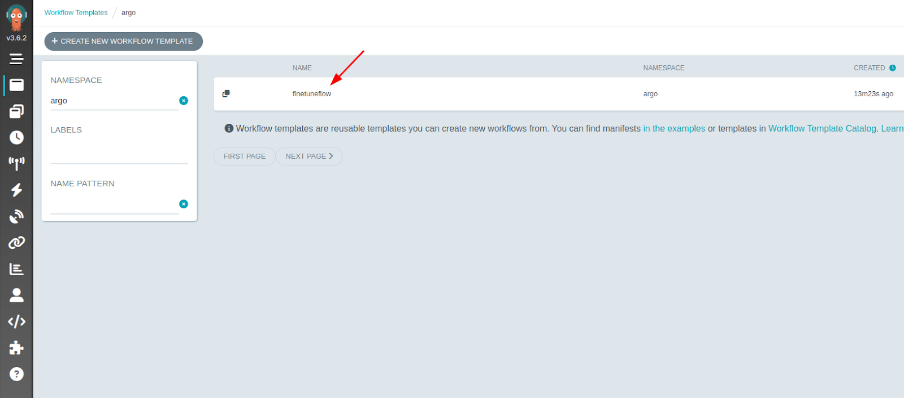
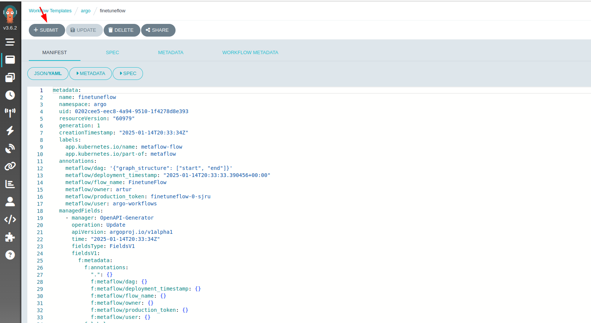
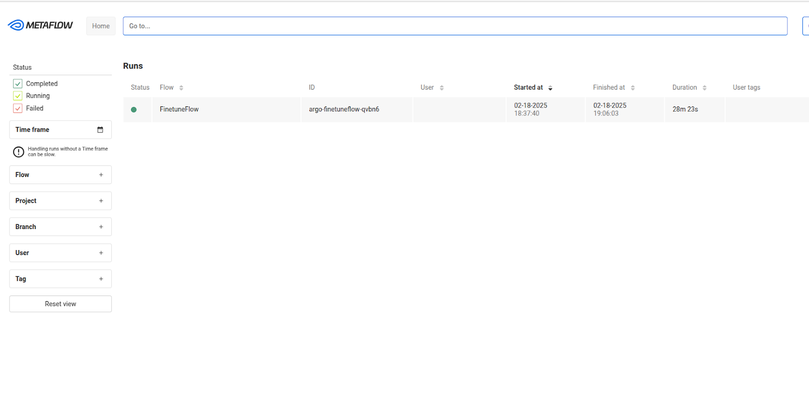
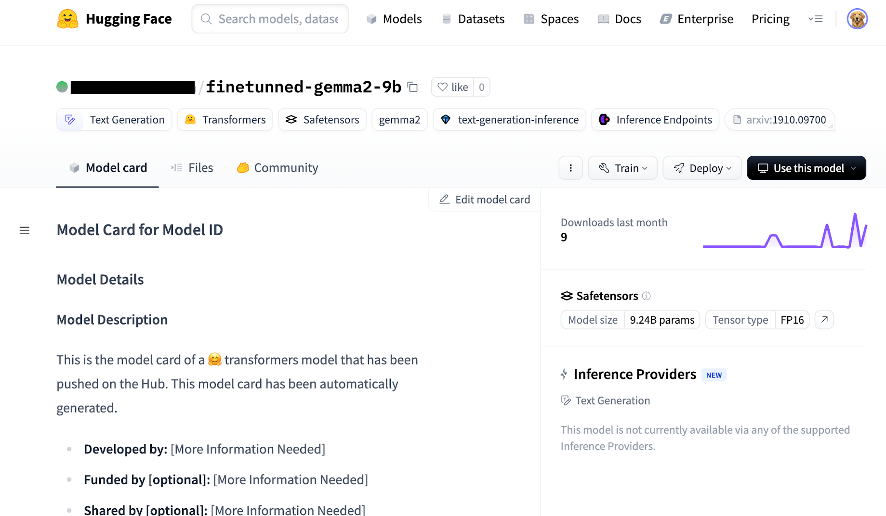

This tutorial will provide instructions on how to deploy and use the [Metaflow](https://docs.metaflow.org/) framework on GKE (Google Kubernetes Engine) and operate AI/ML workloads using [Argo-Workflows](https://argo-workflows.readthedocs.io/en/latest/).
The tutorial is designed for ML Platform engineers who plan to use Metaflow for ML workloads on top of GKE by offloading resource-intensive tasks to a managed cluster.

# Overview

1. Provision [GKE](https://cloud.google.com/kubernetes-engine/docs/concepts/kubernetes-engine-overview) cluster and install [Argo Workflows](https://argoproj.github.io/workflows/) using [Terraform](https://developer.hashicorp.com/terraform/intro).
2. Deploy and configure [Metaflow’s Metadata Service](https://docs.metaflow.org/getting-started/infrastructure).
3. Set up Metaflow to work with Argo Workflows.
4. Build a fine-tuning image with [Cloud Build](https://cloud.google.com/build/docs/overview).
5. Fine-tune the model using Metaflow and Argo Workflow and GKE.
6. Deploy the fine-tuned model on GKE for inference.

# Before you begin

1. Ensure you have a gcp project with billing enabled and [enabled the GKE API](https://cloud.google.com/kubernetes-engine/docs/how-to/enable-gkee).
2. Ensure you have the following tools installed on your workstation

    * [gcloud CLI](https://cloud.google.com/sdk/docs/install)
    * [kubectl](https://kubernetes.io/docs/tasks/tools/#kubectl)
    * [terraform](https://developer.hashicorp.com/terraform/tutorials/aws-get-started/install-cli)
    * [python](https://docs.python.org/3/using/index.html)
    * [venv](https://packaging.python.org/en/latest/guides/installing-using-pip-and-virtual-environments/)

If you previously installed the gcloud CLI, get the latest version by running:

```bash
gcloud components update
```
Ensure that you are signed in using the gcloud CLI tool. Run the following command:

```bash
gcloud auth application-default login
```

# Infrastructure Setup

## Clone the repository

Clone the repository with our guides and cd to the llamaindex/rag directory by running these commands:
```bash
git clone https://github.com/ai-on-gke/tutorials-and-examples.git
cd tutorials-and-examples/mlflow/finetune-gemma
```

## Filesystem structure

* `finetune_inside_metaflow/` \- folder with [Metaflow Flow](https://docs.metaflow.org/metaflow/basics) for fine-tuning the Gemma-2 model.
* `serve_model/` \- a simple deployment manifest for serving the fine-tuned model within the same GKE cluster.
* `metaflow/manifests/` \- folder with Kubernetes manifests. These files are [templates](https://developer.hashicorp.com/terraform/language/functions/templatefile) that require additional processing by the terraform to specify additional values that are not known from the start.
* `terraform/` \- folder with terraform config that executes automated provisioning of required infrastructure resources.

## Create cluster and other resources

In this section we will use `Terraform` to automate the creation of infrastructure resources. For more details how it is done please refer to the terraform config in the `terraform/` folder.
By default, the configuration provisions an Autopilot GKE cluster, but it can be changed to standard by setting `autopilot_cluster = false`.

It creates:

* Cluster IAM Service Account – manages permissions for the GKE cluster.
* Metaflow Metadata Service IAM Service Account – grants Kubernetes permissions for Metaflow’s metadata service using [Workload Identity Federation](https://cloud.google.com/iam/docs/workload-identity-federation)
* Argo Workflows IAM Service Account – grants Kubernetes permissions for Argo Workflows using [Workload Identity Federation](https://cloud.google.com/iam/docs/workload-identity-federation)
* [CloudSQL](https://cloud.google.com/sql/docs/introduction) instance for Metaflow metadata database
* GCS bucket for Metaflow’s artifact storage
* [Artifact registry](https://cloud.google.com/artifact-registry/docs/overview) – stores container images for the fine-tuning process.


1. Go the the terraform directory:

```bash
cd terraform
```

2. Specify the following values inside the `default_env.tfvars` file (or make a separate copy):

    - `<PROJECT_ID>` – replace with your project id (you can find it in the project settings).


Other values can be changed, if needed, but can be left with default values.

3. (Optional) For better state management and collaboration, you can configure Terraform to store its state in a GCS bucket instead of keeping it locally.  [Create a bucket](https://cloud.google.com/storage/docs/creating-buckets#command-line) manually and then uncomment the content of the file `terraform/backend.tf` and specify your bucket:

```hcl
terraform {
   backend "gcs" {
     bucket = "<bucket_name>"
     prefix = "terraform/state/metaflow"
   }
 }
```

4. Init terraform modules:

```bash
terraform init
```

5. Optionally run the `plan` command to view an execution plan:

```bash
terraform plan -var-file=default_env.tfvars
```

6. Execute the plan:

```bash
terraform apply -var-file=default_env.tfvars
```

And you should see your resources created:

```
Apply complete! Resources: 106 added, 0 changed, 0 destroyed.

Outputs:

argo_workflows_k8s_sa_name = "metaflow-tutorial-argo-sa"
cloudsql_instance_name = "metaflow-tutorial-tf"
gke_cluster_location = "us-central1"
gke_cluster_name = "metaflow-tutorial-tf"
metaflow_datastore_bucket_name = "metaflow-tutorial-tf"
metaflow_k8s_namespace = "default"
metaflow_k8s_sa_name = "metaflow-tutorial-sa"
project_id = "akvelon-gke-aieco"

```

7. Configure your kubectl context:

```bash
gcloud container clusters get-credentials $(terraform output -raw gke_cluster_name) --region $(terraform output -raw gke_cluster_location) --project $(terraform output -raw project_id)
```

# Metaflow Configuration

## Deploy Metadata Service

This tutorial includes two Kubernetes manifests for Metaflow Metadata service:

- [*Metadata-service*](https://github.com/Netflix/metaflow-service) \- Keeps track of metadata.
- [*UI-service*](https://github.com/Netflix/metaflow-service/tree/master/services/ui_backend_service) \- Provides a backend instance that powers a web interface for monitoring active flows.

The manifests are generated from templates in the `metaflow/manifests/` directory and put in the `gen` directory.

1. Apply metadata service manifest:

```bash
kubectl apply -f ../gen/metaflow-metadata.yaml
```

2. Wait for deployment is completed:

```bash
kubectl rollout status deployment/metaflow-metadata
```

3. Apply UI service manifest:

```bash
kubectl apply -f ../gen/metaflow-ui.yaml
```

4. Wait for deployment is completed:

```bash
kubectl rollout status deployment/metaflow-ui
```

5. Open new terminal and forward the metadata service port. Keep this terminal running to ensure connection to a remote metadata service:

```bash
kubectl port-forward svc/metaflow-metadata-svc 8080:8080
```

6. Open new terminal and forward port for UI. Keep this terminal running to ensure connection to a Metaflow UI service:

```bash
kubectl port-forward svc/metaflow-ui-svc 8083:8083
```

7. Open  [http://localhost:8083/](http://localhost:8083/). Now all new submitted Metaflow runs will be shown here.


## Install and configure Metaflow locally

1. Create a Python virtual environment, activate it and install Metaflow and other requirements.

```bash
python3 -m venv ../venv
. ../venv/bin/activate
python3 -m pip install metaflow google-cloud-storage google-auth kubernetes==31.0.0
```

2. Create metaflow’s config folder, if not present:

```bash
mkdir -p ~/.metaflowconfig
```

3. Create Metaflow config. Some of the missing values we get from the terraform output.


```bash
cat <<EOF > ~/.metaflowconfig/config.json
{
"METAFLOW_DEFAULT_METADATA": "service",
"METAFLOW_SERVICE_URL": "http://localhost:8080",
"METAFLOW_SERVICE_INTERNAL_URL": "http://metaflow-metadata-svc.default:8080/",
"METAFLOW_DEFAULT_DATASTORE": "gs",
"METAFLOW_DATASTORE_SYSROOT_GS": "gs://$(terraform output -raw metaflow_datastore_bucket_name)",
"METAFLOW_KUBERNETES_NAMESPACE": "argo",
"METAFLOW_KUBERNETES_SERVICE_ACCOUNT": "$(terraform output -raw argo_workflows_k8s_sa_name)",
"METAFLOW_KUBERNETES_DISK": 2048
}
EOF
```

More on Metaflow configuration values:

| Name | Description |
| :---- | :---- |
| METAFLOW\_DEFAULT\_METADATA | With the `service` option, it communicates with the metadata service that has been deployed. |
| METAFLOW\_SERVICE\_URL | URL for your Metaflow CLI to communicate with the metadata backend. |
| METAFLOW\_SERVICE\_INTERNAL\_URL | Internal URL for the same  metadata backend.  |
| METAFLOW\_DEFAULT\_DATASTORE | Specifies the type of storage where metaflow will store artifacts of its runs. In our case it is a GCS bucket.  |
| METAFLOW\_DATASTORE\_SYSROOT\_GS | GCS bucket name to store artifacts produced by metaflow runs.  |
| METAFLOW\_KUBERNETES\_NAMESPACE | Namespace in the cluster for metaflow runs. In our case it is `argo` |
| METAFLOW\_KUBERNETES\_SERVICE\_ACCOUNT | Service account which is assigned to pods with Metaflow runs. |
| METAFLOW\_KUBERNETES\_DISK | Sets disk size for a container for metaflow run. The default value of this option is too big for Autopilot GKE cluster, so we decrease it to 2048 |


# Model Fine-tuning and Serving

## Build the fine-tuning container image

The model fine-tuning process requires a dedicated environment, which we will encapsulate in a container image. The Dockerfile can be found in `finetune_inside_metaflow/image/Dockerfile`.

1. Build the image using [Cloud Build](https://cloud.google.com/build/docs/overview) and push it to the newly created repository. That may take some time:

```bash
gcloud builds submit ../finetune_inside_metaflow/image --config=../cloudbuild.yaml
```

*More details can be found in the [cloudbuild.yaml](https://github.com/ai-on-gke/tutorials-and-examples/blob/main/metaflow/cloudbuild.yaml) file.*

## Fine-tune the model

1. Specify your [HuggingFace token](https://huggingface.co/settings/tokens). It will be used to access model that we want to finetune:

```bash
export HF_TOKEN="<your_token>"
```

2. Specify your HuggingFase user

```bash
export HF_USERNAME="<your_username>"
```

3. Create secret with your token to HuggingFace:

```bash
kubectl -n argo create secret generic hf-token --from-literal=HF_TOKEN=${HF_TOKEN}
```

4. Create argo-workflows template from the metaflow fine-tuning script:

```bash
python3 ../finetune_inside_metaflow/finetune_gemma.py argo-workflows create
```

Here is the overfiew of the FinetuneFlow class:


```
class FinetuneFlow(FlowSpec):

    # specify environment variables required by the finetune process
    @environment(vars={
        # model to finetune
        "MODEL_NAME": "google/gemma-2-9b",
        "LORA_R": "8",
        "LORA_ALPHA": "16",
        "TRAIN_BATCH_SIZE": "1",
        "EVAL_BATCH_SIZE": "2",
        "GRADIENT_ACCUMULATION_STEPS": "2",
        "DATASET_LIMIT": "1000",
        "MAX_SEQ_LENGTH": "512",
        "LOGGING_STEPS": "5",
    })

    # specify kubernetes-specific options
    @kubernetes(
        image=constants.FINETUNE_IMAGE_NAME,
        image_pull_policy="Always",
        cpu=2,
        memory=4096,
        # secret to huggingfase that has to be added as a Kubernetes secret
        secrets=["hf-token"],
        # specify required GPU settings
        gpu=2,
        node_selector={"cloud.google.com/gke-accelerator": "nvidia-l4"},
    )
    @retry
    @step
    def start(self):
        print("Start Fine-tuning")
        import finetune

        finetune.finetune_and_upload_to_hf(
            new_model="finetunned-gemma2-9b"
        )
        self.next(self.end)

    @step
    def end(self):
        print("FinetuneFlow is finished.")

```

5. Open new terminal and forward port for argo-workflows server. Keep this terminal running to ensure uninterrupted access to the argo-workflows UI.

```bash
kubectl -n argo port-forward svc/argo-server 2746:2746
```

6. Open argo-workflows UI at [https://localhost:2746](https://localhost:2746) and go to the [workflow templates](https://localhost:2746/workflow-templates) section. There must be a template that you have created earlier.




7. Select this template and click submit to start the workflow:




Wait until the fine-tuning process is completed and a new model is uploaded to the HuggingFace. It should take around 30 minutes to complete.

Note: There may be temporary warnings about insufficient cluster resources, but they should be eventually resolved in a few minutes.

You can open the Metaflow UI at http://localhost:8083/ to monitor the execution details of your Metaflow flows.

Note: this UI does not display the model upload status to HuggingFace



8. Go to your [Hugging Face](https://huggingface.co/) profile to verify that the fine-tuned model has been uploaded:




## Serve the Fine-Tuned Model on GKE

1. Replace the placeholder for your HuggingFace handle and run this command.

```bash
kubectl create configmap vllm-config --from-literal=model_id="${HF_USERNAME}/finetunned-gemma2-9b"
```

2. Create secret with your token to HuggingFace:

```bash
kubectl create secret generic hf-token --from-literal=HF_TOKEN=${HF_TOKEN}
```

3. Deploy the resulting model to GKE. This will deploy the inference server and it will serve a previously finetuned model. The deployment `serve_model/vllm_deplyment.yaml`  is based on this [instruction](https://cloud.google.com/kubernetes-engine/docs/tutorials/serve-gemma-gpu-vllm#gemma-2-9b-it)


```bash
kubectl apply -f ../serve_model/vllm_deplyment.yaml
```

4. Wait for deployment is completed. It may take some time:

```bash
kubectl rollout status deployment/vllm-gemma-deployment
```

5. Wait until the model is pulled and initialized. Open pod's container log watch:

```bash
kubectl logs  -l app=gemma-server -f

```

When everything is initialized, the end of the logs output should be:

```
INFO:     Started server process [1]
INFO:     Waiting for application startup.
INFO:     Application startup complete.
INFO:     Uvicorn running on http://0.0.0.0:8000
```

Press `Ctrl+C` to quit the log watch.


6. Open another terminal and forward port for of the inference server:

```bash
kubectl port-forward svc/llm-service 8000:8000
```

7. Interact with the model

```bash
USER_PROMPT="Question: What is the total number of attendees with age over 30 at kubecon \\\"EU\\\"? Context: CREATE TABLE attendees (name VARCHAR, age INTEGER, kubecon VARCHAR)\nAnswer:"

curl -X POST http://localhost:8000/generate \
  -H "Content-Type: application/json" \
  -d @- <<EOF
{
    "prompt": "${USER_PROMPT}",
    "temperature": 0.90,
    "top_p": 1.0,
    "max_tokens": 32
}
EOF
```

The output should look like this:

```
{"predictions":["Prompt:\nQuestion: What is the total number of attendees with age over 30 at kubecon \"EU\"? Context: CREATE TABLE attendees (name VARCHAR, age INTEGER, kubecon VARCHAR)\nAnswer:\nOutput:\n SELECT COUNT(name) FROM attendees WHERE age > 30 AND kubecon = \"EU\"\nContext: CREATE TABLE attendees (name VARCHAR, age INTEGER"]}
```

## Cleanup

1. Destroy the provisioned infrastructure.

```bash
cd terraform
terraform destroy -var-file=default_env.tfvars
```

## Troubleshooting

* In case of usage of this guide by multiple people at the same time, consider renaming resource names in the `default_env.tfvars` to avoid name collisions.
* Some operations over the autopilot cluster can hang and complete once the initial scale-up event has finished.
* Sometimes access to the network through `kubectl port-forward` stops working and restarting the command can solve the problem.
