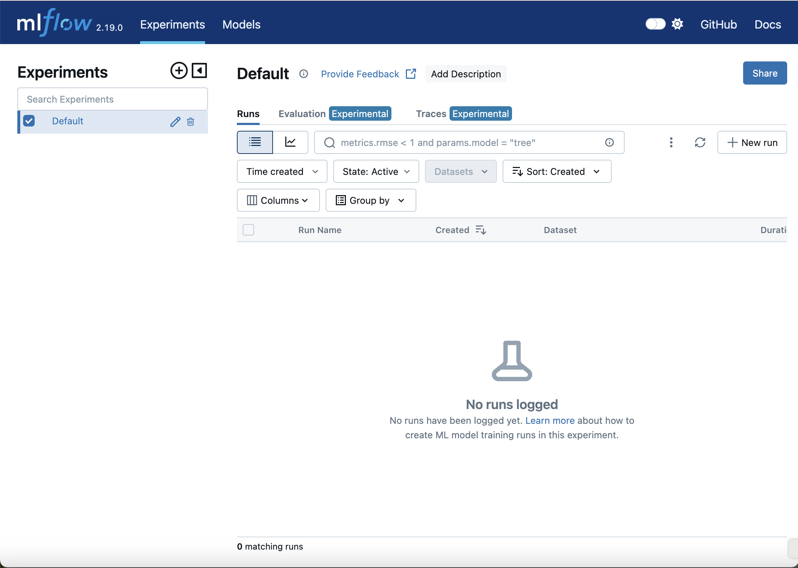
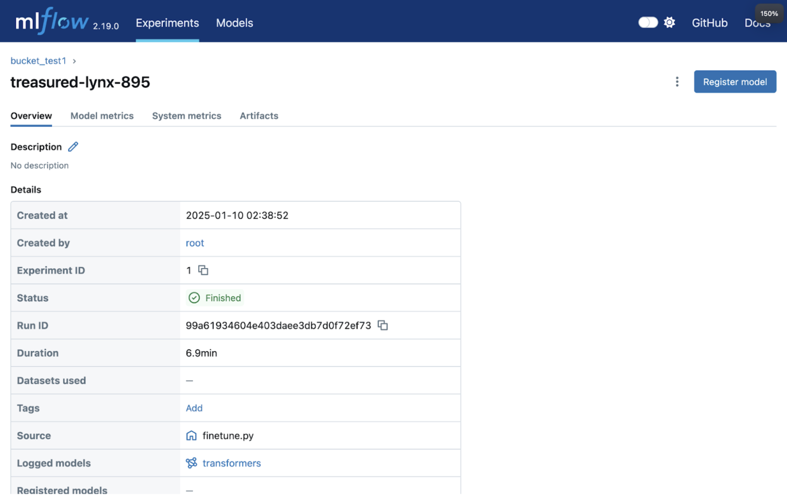
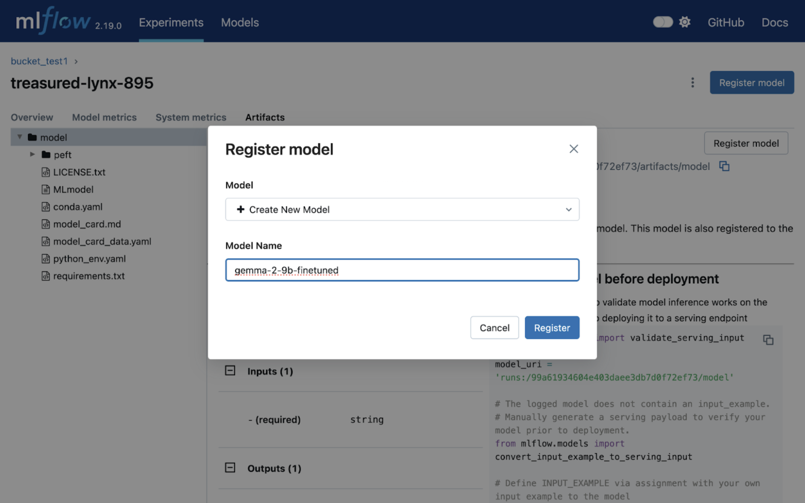
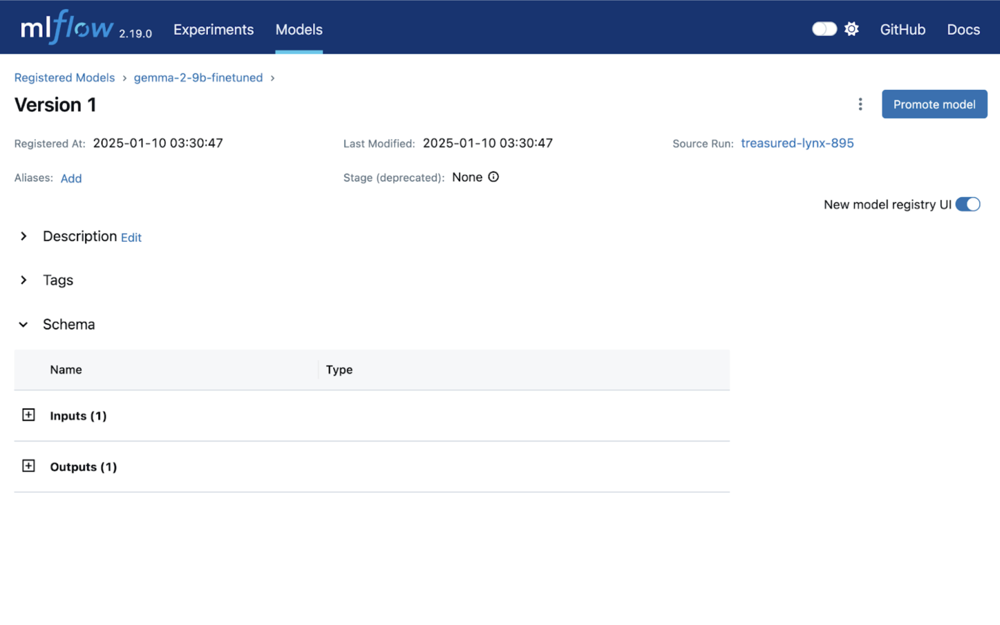

Data scientists often run a lot of experiments and it's essential to be sure that the best run won't be lost in numerous experiments. MLFlow helps to track experiments, datasets, metrics, and other data. GKE clusters can provide a lot of resources on demand.

## The tutorial overview
In this tutorial we will fine-tune gemma-2-9b using LoRA as an experiment in MLFlow. We will deploy MLFlow on a GKE cluster and set up MLFlow to store artifacts inside a GCS bucket. In the end, we will deploy a fine-tuned model using KServe.

## Before you begin
Ensure you have a GCP project with a billing account. Enable the following APIs for your project:
- [GKE](https://console.cloud.google.com/marketplace/product/google/container.googleapis.com?inv=1&invt=Abma5w&project=cvdjango&returnUrl=/kubernetes/overview/get-started?inv%3D1%26invt%3DAbma5w%26project%3Dcvdjango)
- [Artifact Registry API](https://console.cloud.google.com/marketplace/product/google/artifactregistry.googleapis.com?returnUrl=/artifacts?invt%3DAbma5w%26inv%3D1%26project%3Dcvdjango&project=cvdjango&inv=1&invt=Abma5w&flow=gcp)

Ensure you have the following tools installed on your workstation:
```
gcloud CLI
gcloud kubectl
terraform
helm
```
If you previously installed the gcloud CLI, get the latest version by running `gcloud components update`

## Set up
If you don’t have a GCP project, you have to create one. Ensure that your project has access to GKE.

Run these commands to authenticate:
```bash
gcloud auth login
gcloud auth application-default login
```

Run `cd terraform-gke-cluster` and adjust in the `example_environments.tfvars` file the following variables:
- `project_id` – your GCP project id.
- `cluster_name` – any name for your cluster.
- `kubernetes_namespace` – any GKE environment variable namespace.

Run these commands to create your GKE cluster:
```bash
terraform init
terraform plan -var-file=example_environment.tfvars  # verify is it okay
terraform apply -var-file=example_environment.tfvars # print 'yes' when asked
```

After about 10-15 minutes your cluster will be ready to go. When the cluster is ready, run this command to get your GKE cluster access token:
```bash
export KUBECONFIG=~/tutorial_gke_access_token.kube
export REGION=us-central1
export PROJECT_ID=<PROJECT_ID>
export CLUSTER_NAME=<CLUSTER_NAME>
gcloud container clusters get-credentials $CLUSTER_NAME --region $REGION --project $PROJECT_ID
```

The last command connects your current terminal session to the GKE cluster and saves kubectl settings in `KUBECONFIG` path.

>Note: in step 1, the  “[Knative Serving install guide](https://knative.dev/docs/admin/install/serving/install-serving-with-yaml/)” actually also includes the steps to install the networking layer, and it actually prefers Kourier over Istio.

## Install MLFlow
Go to the `mlflow-configuration` directory. We will use the helm to install MLFlow.

Since we want to access our model from MLFlow UI and deploy it using KServe easily, we need to specify environment variables for MLFlow so it could use GCS bucket as artifact storage. Go to the Google Cloud Console and create a GCS bucket.

Before installing the MLFlow [chart](https://artifacthub.io/packages/helm/bitnami/mlflow), we need to adjust `values.yaml` so MLFlow could interact with the GCS bucket. Adjust the following values:
- `<BUCKET_NAME>` – your bucket name.

Install the MLFlow chart:
```bash
helm install my-mlflow-release oci://registry-1.docker.io/bitnamicharts/mlflow -f values.yaml
```

The result of this command will show you how to access MLFlow UI. The output should look similar to this:
```log
Pulled: registry-1.docker.io/bitnamicharts/mlflow:2.3.1
Digest: sha256:a9fb6ade4f8b8f4d7e36a8bd45f174dd55f4d0818c246b91bfc99570cd923450
NAME: my-mlflow-release
LAST DEPLOYED: Tue Jan 14 13:38:02 2025
NAMESPACE: default
...
1. Get the running pods
    kubectl get pods --namespace default -l "app.kubernetes.io/name=mlflow,app.kubernetes.io/instance=my-mlflow-release"

2. Get into a pod
    kubectl exec -ti [POD_NAME] bash

3. Execute your script as you would normally do.
MLflow Tracking Server can be accessed through the following DNS name from within your cluster:

    my-mlflow-release-tracking.default.svc.cluster.local (port 80)

To access your MLflow site from outside the cluster follow the steps below:

1. Get the MLflow URL by running these commands:

   kubectl port-forward --namespace default svc/my-mlflow-release-tracking 80:80 &
   echo "MLflow URL: http://127.0.0.1//"

2. Open a browser and access MLflow using the obtained URL.
3. Login with the following credentials below to see your blog:
...
```

This chart created some service accounts for our MLFlow (you can view them by running `kubectl get serviceaccounts`). In particular, `my-mlflow-release-tracking` is used by the MLFlow tracking server. We need to give this service account a read permission to view all experiments in the GCS bucket. Replace the following variables and run the command below to give the permission:
- `<BUCKET_NAME>`: the GCS bucket’s name that you just created.
- `<PROJECT_NUMBER>`: your GCP project’s number.
- `<PROJECT_ID>`: your GCP project’s ID.
```bash
gcloud storage buckets add-iam-policy-binding gs://<BUCKET_NAME> \
    --role=roles/storage.objectViewer \
    --member=principal://iam.googleapis.com/projects/<PROJECT_NUMBER>/locations/global/workloadIdentityPools/<PROJECT_ID>.svc.id.goog/subject/ns/default/sa/my-mlflow-release-tracking \
    --condition=None
```

Let’s check our MLFlow tracking server via UI. We can port forward MLFlow tracking service by running the command below. This process runs in background due to the `&` sign. You can stop the process by killing it (the PID is printed after running the port-forwarding command).
```bash
kubectl port-forward --namespace default svc/my-mlflow-release-tracking 8080:80 &
```

Check your MLFlow UI at `http://127.0.0.1:8080`. You should be able to see the MLFlow UI like this:


## Fine-tune gemma2-9b using LoRA
Go to the `finetune` directory. Before we start our fine-tuning job, we need to create a kubernetes secret with a huggingface API token and accept the Google license to be able to download the model weights. Go to the [google/gemma-2-9b](https://huggingface.co/google/gemma-2-9b) and accept the license. Then run the commands below to create huggingface secret:
```bash
export HF_TOKEN=<HF_TOKEN>
kubectl create secret generic hf-secret \
    --from-literal=hf_api_token=${HF_TOKEN} \
    --dry-run=client -o yaml | kubectl apply -f -
```

Now we can use MLFlow to track our fine-tuning process as an MLFlow experiment. To do so, we will define several files:
- `cloudbuild.yaml` to use build and push Docker image to Artifact Registry
- `Dockerfile` for containerization
- `finetune.yaml` file for GKE cluster job
- `finetune.py` for fine-tuning

Create an Artifact Registry Docker Repository by running the following command:
```bash
gcloud artifacts repositories create gemma \
    --project=${PROJECT_ID} \
    --repository-format=docker \
    --location=us \
    --description="Gemma Repo"
```

We need to provide read-only access to the `Artifact Registry` to be able to pull Docker images to create a fine-tuning job. Replace the following variables and run the following command to give the access:
- `<SERVICE_ACCOUNT_EMAIL>`: email of your GKE cluster service account.

Get your GKE cluster’s service account email by running:
```bash
gcloud container clusters describe $CLUSTER_NAME \
  --region $REGION \
  --format="value(nodeConfig.serviceAccount)"
```

And give the permission:
```bash
gcloud artifacts repositories add-iam-policy-binding gemma \
    --project="${PROJECT_ID}" \
    --location="us" \
    --member="serviceAccount:<SERVICE_ACCOUNT_EMAIL>" \
    --role="roles/artifactregistry.reader"
```

Now we can build our Docker image for a fine-tuning job. Run the command below:
```bash
gcloud builds submit .
```

In the end, the output should look like this:
```log
DONE
-------------------------------------------------------------------------------------------------------------------------------------
ID                                    CREATE_TIME                DURATION  SOURCE                                                                                           IMAGES                                                                 STATUS
44ff24d5-042f-49e9-9666-5d00a6057e63  2025-01-14T09:45:13+00:00  12M43S    gs://akvelon-gke-aieco_cloudbuild/source/1736847911.742098-6bbf01cd346f41aeb96cdd0ceb658181.tgz  us-docker.pkg.dev/akvelon-gke-aieco/gemma/finetune-gemma-mlflow:1.0.0  SUCCESS
```

In the `finetune.yaml` file you can see the crucial MLFlow environment variables:
- `MLFLOW_URI`: for connecting to the MLFlow tracking server. We set it to `http://my-mlflow-release-tracking:80`, which is an internal GKE cluster URI.
- `MLFLOW_ARTIFACT_URI`: for connecting experiments to our GCS bucket. You should specify it like `gs://<BUCKET_NAME>/<ANY_EXISTING_PATH>`.
- `MLFLOW_EXPERIMENT_NAME`: this is an experiment name. If you want to start a fine-tuning job as a new experiment, then change this variable.

Our `finetune.py` script is using MLFlow to save experiment artifacts in the `MLFLOW_ARTIFACT_URI` path. In the finetune.yaml file you can see that we are using the default service account, so we need to give the GKE cluster’s service account a user permission to save the artifacts. Replace the following variables and run the command below to give the permission:
- `<BUCKET_NAME>`: the GCS bucket’s name that you just created.
- `<PROJECT_NUMBER>`: your GCP project’s number.
- `<PROJECT_ID>`: your GCP project’s ID.

```bash
gcloud storage buckets add-iam-policy-binding gs://<BUCKET_NAME> \
    --role=roles/storage.objectUser \
    --member=principal://iam.googleapis.com/projects/<PROJECT_NUMBER>/locations/global/workloadIdentityPools/<PROJECT_ID>.svc.id.goog/subject/ns/default/sa/default \
    --condition=None
```

Then, inside the `finetune.yaml` file, replace the following variables:
- `<PROJECT_ID>`: with your project ID.
- `<YOUR_BUCKET_PATH>`: with your GCS bucket path.

Then run this command to create fine-tuning job:
```bash
kubectl apply -f finetune.yaml
```

You can review your pods by running the following command.
```bash
kubectl get pods -w
```

After the status of your pod is Running, you can check the running logs via this command:
```bash
kubectl logs <POD_NAME> -f
```

After about 15 minutes you should be able to see fine-tuning logs. The output should look like this:
```log
{'loss': 0.8569, 'grad_norm': 1.615104079246521, 'learning_rate': 1.0277984159122733e-07, 'epoch': 0.99}
{'loss': 0.8612, 'grad_norm': 2.9606473445892334, 'learning_rate': 8.391511416816489e-09, 'epoch': 1.0}
{'train_runtime': 247.4258, 'train_samples_per_second': 4.042, 'train_steps_per_second': 2.021, 'train_loss': 1.1304109792709351, 'epoch': 1.0}
100%|██████████| 500/500 [04:07<00:00,  2.02it/s]
Loading checkpoint shards: 100%|██████████| 3/3 [00:03<00:00,  1.32s/it]
🏃 View run funny-mare-232 at: http://my-mlflow-release-tracking:80/#/experiments/1/runs/31c95f20219946b9934b2f26e4a863af
🧪 View experiment at: http://my-mlflow-release-tracking:80/#/experiments/1
```

Or you can go to your MLFlow and check metrics.The whole fine-tuning experiment should take about 26 minutes.

## Model registry
After the fine-tuning job is finished, you can check the result in MLFlow UI.


Find your experiment and go to the artifacts tab.


Here you can register your model.


Now you have registered an ML model in MLFlow!


## Deployment

In this section we have two subsections that describe a simple deployment and a production like. If you want to just check the model result, you should follow the `Simple deployment` section. If you want to deploy your fine-tuned model using KServe, follow the `KServe deployment` section.

### Simple deployment

Go to the `deploy-gemma2/simple` directory. In this directory you can see the following files:
- `cloudbuild.yaml`: helps us to create and submit a deployment Docker image.
- `deploy.yaml`: creates deployment and service to invoke our fine-tuned model.
- `main.py`: defines a simple FastAPI application with a single API endpoint `predict`.
- `requirements.txt`: defines FastAPI dependencies.

To deploy our model, we need to create a new repository in the artifact registry. Run the commands below:
```bash
gcloud artifacts repositories create gemma-deployment \
    --project=${PROJECT_ID} \
    --repository-format=docker \
    --location=us \
    --description="Gemma Deployment Repo"
```

And give your GKE cluster service account read access by running:
```bash
gcloud artifacts repositories add-iam-policy-binding gemma-deployment \
    --project="${PROJECT_ID}" \
    --location="us" \
    --member="serviceAccount:<SERVICE_ACCOUNT_EMAIL>" \
    --role="roles/artifactregistry.reader"
```

Run this command to submit a deployment Docker image to your repository:
```bash
gcloud builds submit .
```

After the command is completed, edit the following variables in `deploy.yaml` file:
- `<PROJECT_ID>`: your project ID.
- `<YOUR_BUCKET_NAME>`: your bucket where you store the fine-tuned model.
- `<MLFLOW_RUN_ID>`: the MLFLow experiments's ID.

And run the following command to deploy the model:
```bash
kubectl apply -f deploy.yaml
```

To check status of your deployment, find your pod name by running `kubectl get pods` and then run this command to check the logs:
```bash
kubectl logs <POD_NAME> -f
```

You can consider your deployment seccessful and ready to use when your logs look like this:
```log
Loading checkpoint shards: 100%|██████████| 35/35 [00:52<00:00,  1.49s/it]
INFO:     Started server process [1]
INFO:     Waiting for application startup.
INFO:     Application startup complete.
INFO:     Uvicorn running on http://0.0.0.0:11434 (Press CTRL+C to quit)
```

Run this command to forward the port for your service:
```bash
kubectl port-forward svc/gemma2-9b-finetuned-service 8081:11434
```

And go to the `http://127.0.0.1:8081/docs`. Here you should be able to invoke your model. For example, for input:
```log
Question: What is the total number of attendees with age over 30 at kubecon "eu"?\nContext: CREATE TABLE attendees (name VARCHAR, age INTEGER, kubecon VARCHAR)\n\nAnswer:
```

The output should look like this:
```log
SELECT COUNT(*) FROM attendees WHERE age > 30 AND kubecon = "eu"
```

#### Clean up
Remove the artifact registry permission:
```bash
gcloud artifacts repositories remove-iam-policy-binding gemma-deployment \
    --project="${PROJECT_ID}" \
    --location="us" \
    --member="serviceAccount:<SERVICE_ACCOUNT_EMAIL>" \
    --role="roles/artifactregistry.reader"
```

### KServe deployment

Go to the `deploy-gemma2/kserve` directory. In this section we will use KServe to deploy our fine-tuned model.

To install KServe, you can follow [the guide in our repo](https://github.com/GoogleCloudPlatform/ai-on-gke/tree/main/tutorials-and-examples/kserve). After the successful installation, we need to patch the deployment mode and create an ingress class.
Run the command below:
```bash
kubectl patch configmap/inferenceservice-config -n kserve --type=strategic -p '{"data": {"deploy": "{\"defaultDeploymentMode\": \"RawDeployment\"}"}}'
```

The command above switches deployment mode from Serverless to RawDeployment, which bypasses Knative. RawDeployment mode directly manages Kubernetes resources for model deployment, which can offer more flexibility.

Also install the ingress class by running this command:
```bash
kubectl apply -f - <<EOF
apiVersion: networking.k8s.io/v1
kind: IngressClass
metadata:
  name: istio
spec:
  controller: istio.io/ingress-controller
EOF
```

We need this class to be able to invoke the deployed model.

Before deployment, we have to prepare the environment for the mlserver. Since [seldonio/mlserver](https://hub.docker.com/r/seldonio/mlserver/tags)'s libraries might be outdated, we can provide our custom environment with libraries that we need (you can read more detail [here](https://cloud.google.com/kubernetes-engine/docs/how-to/persistent-volumes/cloud-storage-fuse-csi-driver)).

You can see that we have a `conda-configs` directory. Inside this directory is a `yaml` file that will be used to create our custom environment. Create a configmap with this `environment.yaml` by running this command below:
```bash
kubectl create configmap conda-requirements --from-file=conda-configs
```

Before you run environment creation job, you need to adjust values in the `create-tarball.yaml` and deploy.yaml:
- `<YOUR_BUCKET_NAME>` – you should paste your bucket name here.

Now we can run our environment creation job:
```bash
kubectl apply -f create-tarball.yaml
```

You can check the progress of the tarball creation by running the following command:
```bash
kubectl logs <POR_NAME> -f
```

After the job is done, you can see that your bucket now has `mlflow-gemma2-env.tar.gz` tarball. We will use it in the deploy.yaml.
Change the following variables in the `deploy.yaml` file:
- `<PATH_TO_YOUR_MODEL>` – you can find the path in the MLFlow UI (it should look like `gs://<BUCKET_NAME>/asdf12345/artifacts/model`).
- `<YOUR_BUCKET_NAME>` – your bucket name that should be mounted via gcsfuse to install your conda environment.

Run the command below:
```bash
kubectl apply -f deploy.yaml
```

You can check deployment status by this command:
```bash
kubectl get inferenceservices -w
```

The output should look like this:
```log
NAME                                  URL                                                              READY   PREV   LATEST   PREVROLLEDOUTREVISION   LATESTREADYREVISION   AGE
gemma-2-9b-finetuned                  http://gemma-2-9b-finetuned-default.example.com                  True                                                                  4m34s
```

When the inferenceservice gets the `READY=True`, you can invoke fine-tuned model using these commands below to access the model:
```bash
SERVICE_HOSTNAME=$(kubectl get inferenceservice gemma-2-9b-finetuned -o jsonpath='{.status.url}' | cut -d "/" -f 3)
INGRESS_HOST=127.0.0.1
INGRESS_PORT=8081
kubectl port-forward -n istio-system svc/istio-ingressgateway $INGRESS_PORT:80 &
```

And the model call command:
```bash
curl -v \
  -H "Host: ${SERVICE_HOSTNAME}" \
  -H "Content-Type: application/json" \
  -d @./input.json \
  http://${INGRESS_HOST}:${INGRESS_PORT}/v2/models/gemma-2-9b-finetuned/infer | jq
```

The output should be like this:
```log
{
  "model_name": "gemma-2-9b-finetuned-1",
  "id": "d0d248ea-1b4b-42a0-bf96-14b95819daac",
  "parameters": {
    "content_type": "str"
  },
  "outputs": [
    {
      "name": "output-1",
      "shape": [
        1,
        1
      ],
      "datatype": "BYTES",
      "parameters": {
        "content_type": "str"
      },
      "data": [
        "SELECT COUNT(*) FROM attendees WHERE age > 30 AND kubecon = \"eu\""
      ]
    }
  ]
}
```

## Clean up
To clean up, you need to go to the `terraform-gke-cluster` directory and run the following command:
```bash
terraform destroy -var-file=example_environment.tfvars
```

Remove all permissions that you gave during this tutorial:
```bash
gcloud storage buckets remove-iam-policy-binding gs://<BUCKET_NAME> \
    --role=roles/storage.objectViewer \
    --member=principal://iam.googleapis.com/projects/<PROJECT_NUMBER>/locations/global/workloadIdentityPools/<PROJECT_ID>.svc.id.goog/subject/ns/default/sa/my-mlflow-release-tracking \
    --condition=None

gcloud storage buckets remove-iam-policy-binding gs://<BUCKET_NAME> \
    --role=roles/storage.objectUser \
    --member=principal://iam.googleapis.com/projects/<PROJECT_NUMBER>/locations/global/workloadIdentityPools/<PROJECT_ID>.svc.id.goog/subject/ns/default/sa/default \
    --condition=None

gcloud artifacts repositories remove-iam-policy-binding gemma \
    --project="${PROJECT_ID}" \
    --location="us" \
    --member="serviceAccount:<SERVICE_ACCOUNT>" \
    --role="roles/artifactregistry.reader"
```

Delete your GCS bucket where you stored everything during the guide and Artifact registry repo `gemma`.
